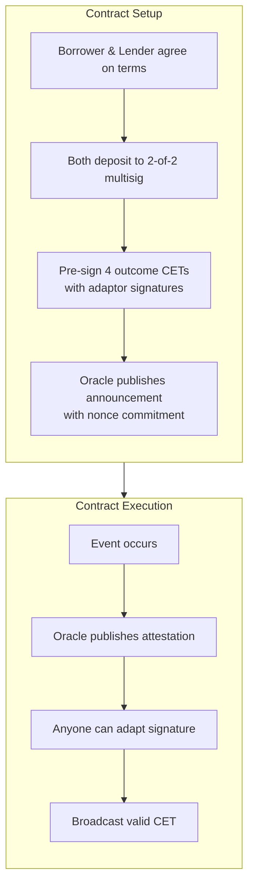
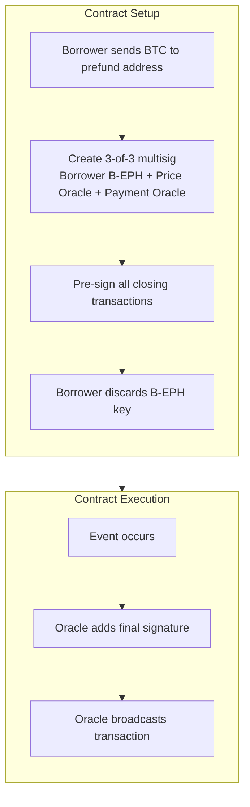
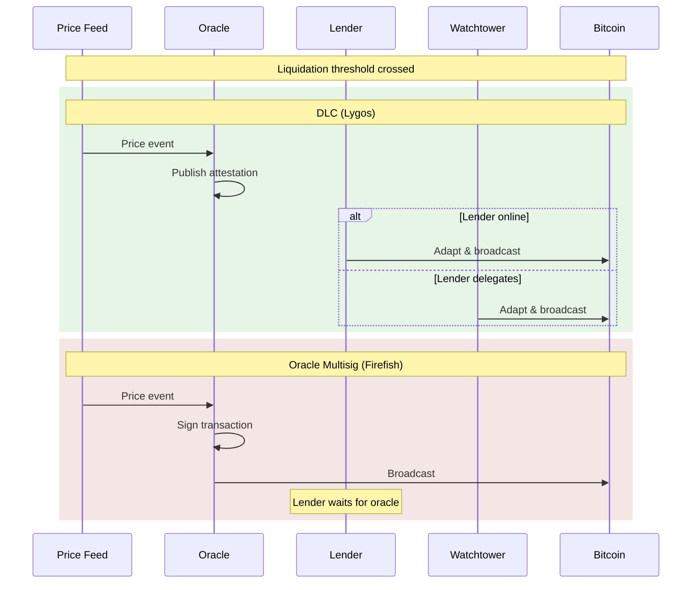
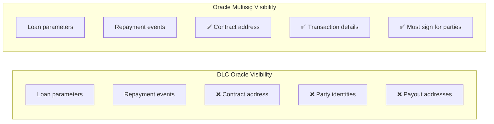
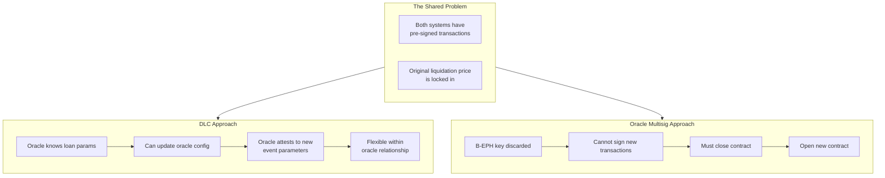
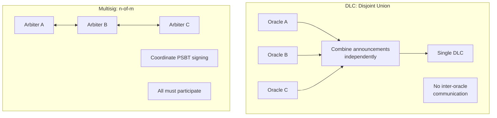
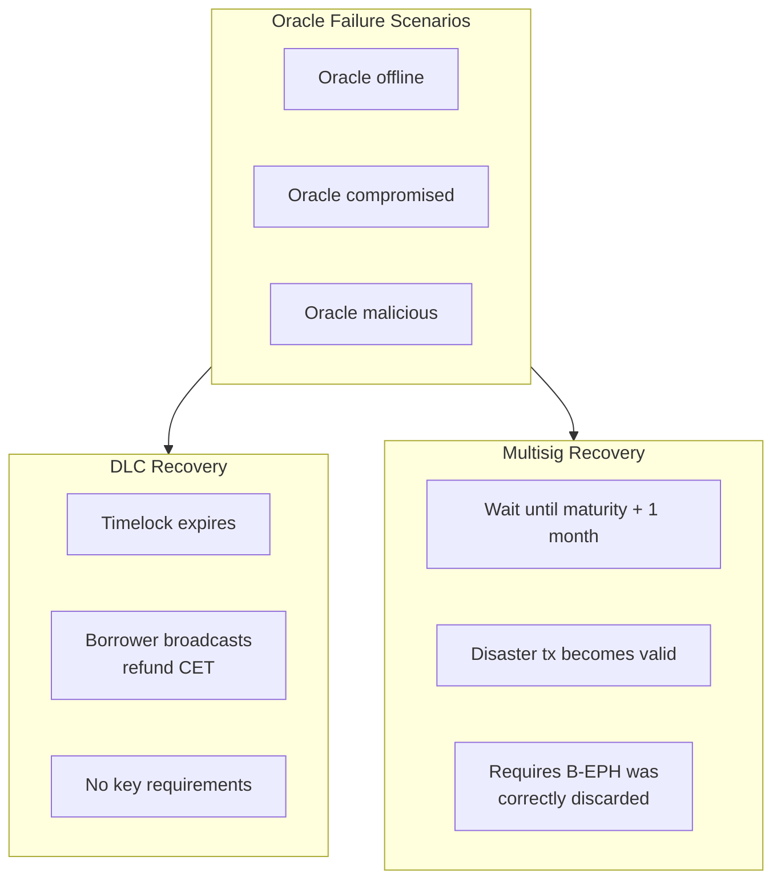

*Non-custodial Bitcoin-backed lending is an emerging field with multiple architectural approaches. This post provides an objective technical comparison between DLC-based systems (as implemented by Lygos) and oracle multisig systems (as implemented by Firefish), examining the trade-offs each approach makes.*

---

## Background: The Problem Both Solve

Bitcoin-backed lending allows borrowers to access liquidity (fiat or stablecoins) while retaining economic exposure to their Bitcoin. The core challenge is securing the collateral in a way that:

1. Prevents any single party from unilaterally stealing funds
2. Enables price-based liquidation when collateral value drops
3. Returns collateral to borrowers upon successful repayment
4. Provides recovery mechanisms if systems fail

Both DLC-based and oracle multisig approaches attempt to solve this problem without full custody by any single party.

---

## Architecture A: DLC-Based (Lygos)

Discreet Log Contracts use adaptor signatures to create Bitcoin transactions that become valid when an oracle publishes a cryptographic attestation.

### Core Structure

### Key Properties

| Property | Description |
| -------- | ----------- |
| Multisig | 2-of-2 between Borrower and Lender |
| Oracle Role | Attestation only (publishes signatures, doesn't sign transactions) |
| Outcomes | 4 enumerated: Not Funded, Repaid, Liquidated by Price, Liquidated by Maturity |
| Execution | Any party can broadcast once attestation is public |
| Key Management | No key discarding required |

### What the Oracle Knows

The Lygos oracle (Magnolia) knows:
- Loan parameters (amount, liquidation price, maturity)
- Repayment status (whether stablecoin was returned)

The oracle does NOT know:
- Contract addresses (where BTC is locked)
- Borrower or lender identities
- Payout addresses
- Which UTXOs are involved

---

## Architecture B: Oracle Multisig (Firefish)

Firefish uses a 3-of-3 multisig where oracles are transaction signers rather than attestation publishers.

### Core Structure

### Key Properties

| Property | Description |
| -------- | ----------- |
| Multisig | 3-of-3 between Borrower (ephemeral), Price Oracle, Payment Oracle |
| Oracle Role | Transaction signer (must actively sign at execution) |
| Outcomes | 5 closing transactions: Repayment, Default, Liquidation, Cancellation, Disaster |
| Execution | Oracle must sign and broadcast |
| Key Management | Borrower must discard ephemeral key (B-EPH) |

### What the Oracle Knows

Firefish oracles know:
- All loan parameters
- Transaction details they must sign
- Contract addresses
- Involved parties (they're signing transactions for them)

---

## Comparison Matrix

### Execution Model

| Aspect | DLC (Lygos) | Oracle Multisig (Firefish) |
| ------ | ----------- | -------------------------- |
| Who executes | Any party with adaptor sigs | Oracle only |
| Watchtower support | Yes | No |
| Oracle liveness requirement | Only for attestation | For signing & broadcasting |
| Delegation possible | Yes | No |

### Privacy Analysis

| Privacy Dimension | DLC (Lygos) | Oracle Multisig (Firefish) |
| ----------------- | ----------- | -------------------------- |
| Oracle knows loan params | Yes | Yes |
| Oracle knows contract address | No | Yes (must sign) |
| Oracle knows parties | No | Yes (signs their txs) |
| On-chain privacy | Looks like 2-of-2 multisig | Looks like 3-of-3 multisig |

### Collateral Top-ups

A critical feature for lending is the ability to add collateral when price approaches liquidation.

| Top-up Capability | DLC (Lygos) | Oracle Multisig (Firefish) |
| ----------------- | ----------- | -------------------------- |
| Same contract | Possible (oracle update) | Not possible (key discarded) |
| Requires new contract | No | Yes |
| Oracle trust increase | Minimal | N/A (same problem) |

### Multi-Oracle Extensibility

| Multi-Oracle Path | DLC (Lygos) | Oracle Multisig (Firefish) |
| ----------------- | ----------- | -------------------------- |
| Mechanism | Disjoint union of announcements | n-of-m multisig |
| Oracle coordination | Not required | Required |
| Oracles know each other | No | Yes |
| Implementation complexity | Lower | Higher |

### Failure Modes

| Failure Mode | DLC (Lygos) | Oracle Multisig (Firefish) |
| ------------ | ----------- | -------------------------- |
| Oracle offline | Timelock refund | Disaster recovery (maturity + 1 month) |
| Key discard risk | None | B-EPH must be correctly discarded |
| Recovery mechanism | Pre-signed CET | Pre-signed disaster tx |

---

## Trade-off Analysis

### What DLCs Trade Off

1. **Pure oracle blindness**: Oracle must know loan parameters for practical operation
2. **Shared announcements**: Each loan requires its own oracle event (though this is inherent to loans having unique parameters)

### What DLCs Gain

1. **Non-interactive execution**: Any party can execute once attestation is public
2. **Watchtower compatibility**: Execution can be delegated to third parties
3. **On-chain privacy**: Oracle doesn't see contract addresses or involved parties
4. **Simpler key management**: No ephemeral key discarding required
5. **Flexible parameter updates**: Oracle awareness enables smooth top-ups
6. **Multi-oracle path**: Disjoint union works without oracle coordination

### What Oracle Multisig Trades Off

1. **Interactive execution**: Oracle must be active and responsive at execution time
2. **No delegation**: Oracle IS the execution layer, cannot be replaced
3. **Reduced on-chain privacy**: Oracles must know transaction details to sign
4. **Same top-up problem**: Pre-signed transactions are locked in after key discard
5. **Key discard complexity**: Critical irreversible step in setup
6. **Multi-oracle coordination**: Arbiters must communicate and know each other

### What Oracle Multisig Gains

1. **Conceptual simplicity**: Standard multisig is well-understood
2. **No adaptor signatures**: Relies on standard Bitcoin scripting
3. **Deterministic outputs**: Funds can only go to predetermined addresses

---

## Use Case Suitability

### DLCs May Be Better For

- Lenders who want watchtower/delegation support
- High-frequency lending where oracle latency matters
- Multi-oracle requirements for reduced trust
- Borrowers concerned about on-chain privacy
- Systems that need flexible parameter updates

### Oracle Multisig May Be Better For

- Simple implementations without adaptor signature complexity
- Cases where oracle signing latency is acceptable
- Parties comfortable with oracle execution dependency
- Systems where conceptual simplicity is paramount

---

## Future Considerations

### Covenant Opcodes

If Bitcoin gains covenant opcodes like CTV or TXHASH:
- DLCs could enforce payout functions without adaptor signatures
- Both approaches could become simpler
- Multi-oracle coordination could be script-enforced

### Oracle Evolution

Both approaches benefit from:
- Improved oracle infrastructure
- Multiple competing oracles
- Better accountability mechanisms

---

## Conclusion

Both DLC-based and oracle multisig approaches represent legitimate attempts at non-custodial Bitcoin lending. The choice between them depends on which trade-offs matter most for a given use case.

DLCs offer advantages in execution flexibility, delegation, and multi-oracle extensibility at the cost of oracle parameter awareness. Oracle multisig offers conceptual simplicity at the cost of execution interactivity and delegation capability.

The "right" choice depends on:
- Whether watchtower/delegation support is needed
- Privacy requirements for on-chain data
- Multi-oracle roadmap
- Tolerance for oracle execution dependency

Neither approach is categorically superior—they represent different points in the design space for non-custodial Bitcoin lending.

---

*This comparison is based on publicly available documentation from [Lygos Finance](https://lygos.finance) and [Firefish](https://docs.firefish.io/firefish-protocol). For technical implementation details, refer to the respective documentation.*

*For more on Lygos's enumerated DLC approach, see [DLCs are perfect for Lending](/posts/dlc-are-perfect-for-lending/).*
