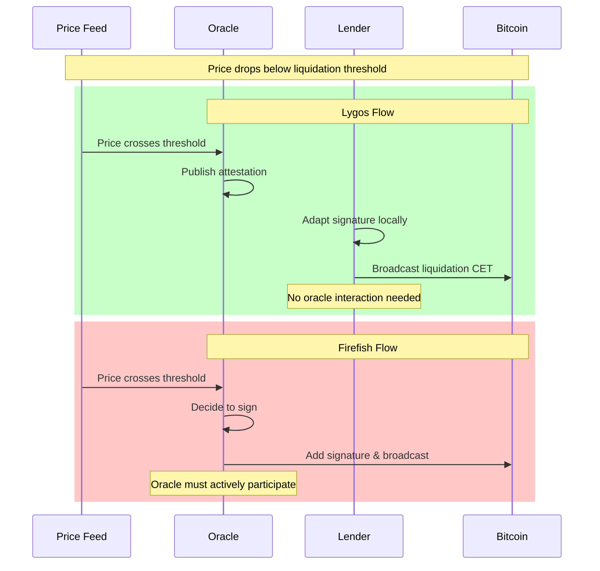
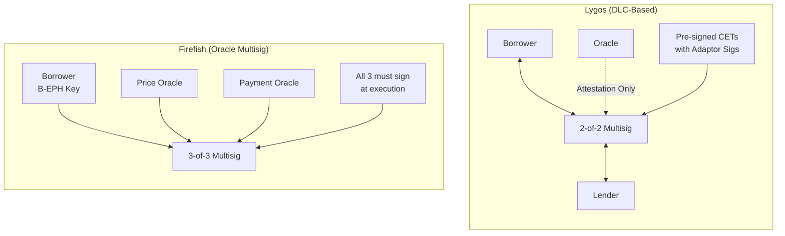
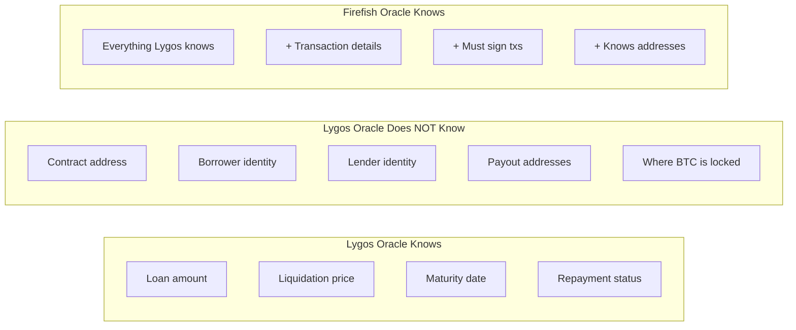
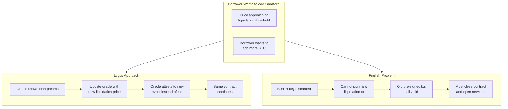
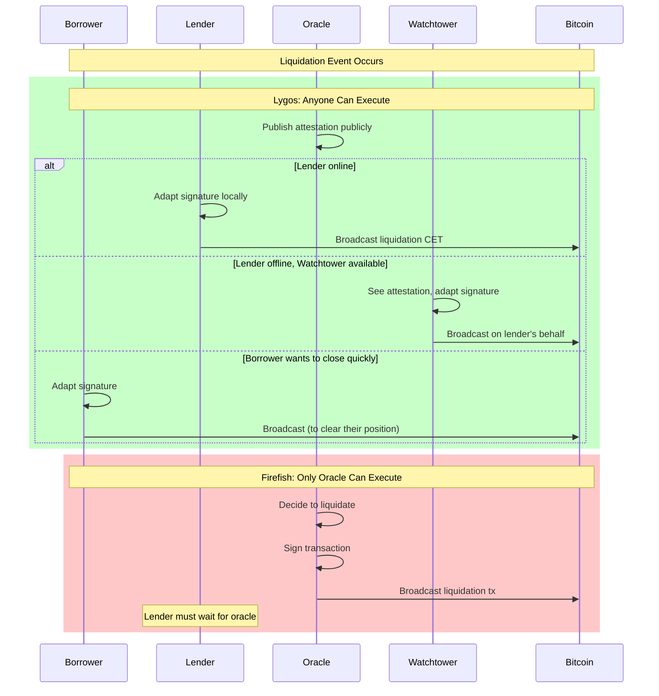
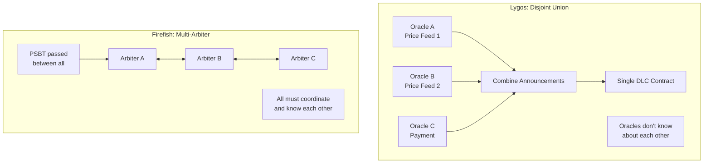

*Firefish recently published a paper titled "Why DLCs are a poor fit for Bitcoin-backed lending." As someone who has shipped DLC financial products settling hundreds of millions of dollars and is currently building [Lygos Finance](https://lygos.finance), I want to address their claims and explain why the reality is more nuanced than their paper suggests.*

---

## The Paper's Central Claims

Firefish argues that DLCs fail to deliver on three properties they consider essential:

1. **Scalability**: The oracle should not interact with any contract
2. **Privacy**: The oracle should not know any details about contracts
3. **Accountability**: The oracle cannot attest to different outcomes without compromising its key

They conclude that because Lygos's oracle knows about each loan, we "forgo the three core properties that define DLCs" and therefore "cannot be regarded as a pure DLC-based solution."

Let's examine what they got right, what they missed, and what their own solution actually trades off.

---

## What They Got Right

I'll acknowledge upfront where Firefish makes valid points:

### Our Oracle Knows About Loans

Yes, the Magnolia oracle knows about each loan's parameters: the loan amount, liquidation price, maturity date, and repayment status. This is necessary for practical lending operations.

### Recovery Transactions Exist in Both Systems

Both Lygos and Firefish have timelock-based recovery mechanisms. If oracles disappear, borrowers can eventually recover their Bitcoin. This is parity—neither system has an advantage here.

### Adaptor Signature "Adaptation" Is Required

In DLCs, when the oracle publishes an attestation, the adaptor signature must be "adapted" into a valid signature. This is true. But as we'll see, this is a trivial local computation—not network interaction.

---

## What They Missed: The Execution Model

Here's where Firefish's analysis falls short. They focus on what the oracle *knows* but ignore what the oracle must *do*.

### Lygos: Set-and-Forget Execution

In our DLC-based system:

1. Both parties pre-sign all 4 outcome transactions with adaptor signatures
2. Oracle publishes an attestation when an event occurs
3. **Anyone** with the adaptor signatures can adapt them and broadcast the valid CET

The oracle doesn't sign transactions. It doesn't broadcast anything to the Bitcoin network. It simply publishes an attestation—a cryptographic statement about which outcome occurred.

### Firefish: Oracle Must Actively Sign

In Firefish's 3-of-3 multisig:

1. All parties pre-sign closing transactions
2. Borrower **discards** their ephemeral key (B-EPH)
3. When an outcome occurs, **the oracle must actively add the final signature**
4. The oracle broadcasts the transaction

The oracle isn't just an observer—it's an active participant in execution.

### Why This Matters for Liquidation

Imagine a scenario: Bitcoin price is crashing, approaching the liquidation threshold. The lender needs to liquidate quickly to recover their funds.

**With Lygos:** The oracle publishes an attestation. The lender (or their watchtower, or even the borrower wanting to clear their position) can immediately broadcast the liquidation CET. No waiting for oracle interaction.

**With Firefish:** The lender must wait for the oracle to decide to sign and broadcast. If the oracle is slow, overwhelmed, or having technical issues, the lender is stuck waiting.

This is the "interactivity at execution" problem Firefish claims DLCs have. But they have it backwards:

> In DLCs, anyone can execute once the attestation is public. In Firefish's system, only the oracle can execute.

---

## The Architecture Difference

Let's visualize the fundamental architectural difference:

| Aspect | Lygos (DLC) | Firefish (3-of-3 Multisig) |
| ------ | ----------- | -------------------------- |
| Core Structure | 2-of-2 multisig + Oracle attestations | 3-of-3 multisig with Oracle keys |
| Oracle Role | Attestation-only | Active transaction signer |
| Execution | Anyone can broadcast | Oracle must sign & broadcast |
| Key Discarding | Not required | Borrower must discard B-EPH |

---

## Privacy: Who Really Knows More?

Firefish claims our approach sacrifices privacy. Let's compare what each oracle actually knows:

### What Magnolia (Lygos Oracle) Knows

- Loan parameters (amount, liquidation price, maturity)
- Whether events occurred (funded, repaid, liquidated)

### What Magnolia Does NOT Know

- The contract address (where the BTC is locked)
- The borrower's identity
- The lender's identity
- The payout addresses
- Which UTXOs are involved

### What Firefish Oracles Know

Since they're transaction signers, they must know:
- Everything above, PLUS
- The full transaction details they're signing
- The addresses involved
- The UTXOs being spent

**The "privacy" trade-off Firefish criticizes actually makes our oracle MORE blind to on-chain details than their signing oracles.**

---

## The Collateral Top-up Irony

Here's where Firefish's argument really falls apart. In their paper, they criticize DLCs:

> "The original liquidation price is already hardcoded in CETs... Bitcoin collateral must be moved into a new UTXO"

They're saying DLCs can't handle collateral top-ups without closing the contract. But let's examine their own system:

### Firefish's Top-up Problem

1. Borrower signs all closing transactions with B-EPH key
2. Borrower **permanently discards** the B-EPH key
3. Now the pre-signed transactions are locked in
4. Borrower cannot sign new transactions with a different liquidation price

**This is the exact same problem they criticize DLCs for.** The pre-signed transactions are just as "hardcoded" as DLC CETs.

### The Twist: Our "Trade-off" Enables Better Top-ups

Remember what Firefish criticizes us for? "The oracle knows about each loan."

**This is precisely what enables Lygos to handle top-ups gracefully:**

- Since Magnolia knows the loan parameters, we can update them
- Oracle can attest to the new liquidation price event instead of the old one
- No need for oracles to coordinate on "not signing" something
- No need to close the contract and open a new one

Firefish would need to either:
1. Close old contract, open new one (same as they criticize DLCs for)
2. Trust oracles to coordinate on not signing the old liquidation tx (significantly increases trust requirements)

**Their critique backfires: the "impurity" they criticize is what makes our system more flexible.**

---

## Watchtower Support: Anyone Can Execute

One of the most powerful properties of DLCs is watchtower compatibility:

In Lygos:
- Lender can delegate execution to a watchtower
- Watchtower monitors oracle attestations
- When liquidation is attested, watchtower broadcasts on lender's behalf
- Lender doesn't need to be online

In Firefish:
- Oracle IS the execution layer
- No delegation possible
- Lender must trust oracle will execute promptly

---

## Multi-Oracle: The Path Forward

Firefish mentions oracle dependence as a concern. Let's compare how each system scales to multiple oracles:

### Lygos: Disjoint Union

With DLCs and disjoint union:
- Combine announcements from multiple independent oracles
- Oracles don't need to know about each other
- No communication between oracles required
- Can mix different price oracles with different payment oracles
- Oracles don't even know if their announcements are being used

### Firefish: Multi-Arbiter Nightmare

To add multiple oracles to a signing-based system:
- Need n-of-m multisig coordination
- All signers need custom software
- PSBTs passed between arbiters ("hot potato")
- All arbiters must know about each other
- Easier for arbiters to collude (they're already coordinating)

**The DLC architecture inherently supports multi-oracle better than the signing-arbiter model.**

---

## Addressing Their Specific Claims

### Claim: "22 Million CETs" Problem

Firefish describes needing CETs for every (date × price) combination. This is true for perpetual-style contracts with numeric payout curves.

**But lending doesn't need that.** We use 4 enumerated outcomes:
- Not funded (48h timeout)
- Repaid
- Liquidated by price
- Liquidated by maturity

That's 4 CETs. Setup takes ~5 seconds.

### Claim: "DLCs Require Interactivity at Execution"

Firefish says: "In DLCs, the lender needs to use the oracle's attestation to adapt the presignature."

Yes, adapting a signature is required. But this is:
- A **local** computation
- Requires no network interaction
- Can be done by anyone with the adaptor signatures
- Can be delegated to a watchtower

Compare to Firefish where the oracle must:
- Actively decide to sign
- Sign the transaction
- Broadcast to the network
- Be responsive at execution time

**Which system actually has the interactivity problem?**

### Claim: "Refund Transaction Is Not Exclusive to DLCs"

True. Both systems have recovery mechanisms:
- Lygos: Timelock-based refund CET
- Firefish: Disaster recovery after maturity + 1 month

But Firefish has additional complexity:
- Borrower must discard B-EPH key correctly
- If key is discarded prematurely, funds could be stuck
- Key discard is an irreversible, critical step

In Lygos, no key discarding is required.

---

## The Real Trade-offs

Let me be honest about the actual trade-offs:

### What Lygos Trades Off

1. **Pure Oracle Blindness**: Our oracle knows loan parameters (but NOT on-chain details)
2. **One Announcement per Loan**: We don't share announcements across loans (because each loan has unique parameters anyway)

### What Lygos Gains

1. **Non-Interactive Execution**: Anyone can execute with oracle attestation
2. **Watchtower Support**: Execution can be delegated
3. **Better Privacy of On-Chain Data**: Oracle doesn't know contract addresses or parties
4. **Flexible Top-ups**: Oracle can be updated without closing contract
5. **Cleaner Key Management**: No ephemeral key discarding required
6. **Clear Multi-Oracle Path**: Disjoint union works without oracle coordination

### What Firefish Trades Off

1. **Interactive Execution**: Oracle must actively sign at execution time
2. **No Watchtower Support**: Oracle IS the execution layer
3. **Oracle Sees On-Chain Data**: Signers must know transaction details
4. **Same Top-up Problem**: Pre-signed transactions are just as "locked in"
5. **Key Discard Risk**: Borrower must correctly discard B-EPH
6. **Multi-Oracle Complexity**: Requires arbiter coordination

---

## Conclusion

Firefish makes interesting points about DLC trade-offs, and I respect the technical depth of their work. But their conclusion that DLCs are "a poor fit for Bitcoin-backed lending" misses crucial advantages of the DLC execution model.

The properties they value—scalability, privacy, accountability—are important. But so are:
- Non-interactive execution
- Watchtower compatibility
- Clean key management
- Multi-oracle extensibility

**DLCs aren't just about what the oracle knows. They're about what the oracle has to DO.**

In Lygos, the oracle attests. In Firefish, the oracle executes.

That's the fundamental difference, and it's why DLCs remain the better foundation for Bitcoin-backed lending.

---

*Learn more about Lygos Finance at [lygos.finance](https://lygos.finance) or follow [@LygosFinance](https://twitter.com/LygosFinance) on Twitter.*

*Read our previous post on [DLCs are perfect for Lending](/posts/dlc-are-perfect-for-lending/) for more technical details on our enumerated outcome approach.*
