*This post provides a detailed technical comparison of two approaches to non-custodial Bitcoin-backed lending: DLC-based systems using adaptor signatures and oracle multisig systems using standard ECDSA/Schnorr multi-party signing. We examine the cryptographic primitives, transaction flows, security models, and liveness requirements of each approach.*

---

## Cryptographic Primitives

### DLC Adaptor Signatures

DLCs rely on adaptor signatures, which are "incomplete" signatures that can be completed (adapted) given knowledge of a discrete logarithm.

#### Construction

Given:
- Oracle public key `O = oG`
- Oracle nonce `R = kG`
- Message `m` to sign
- Signer secret key `x`

The adaptor signature protocol:

1. **Oracle Announcement**: Oracle publishes `(R, m_event)` committing to attest to outcome of `m_event`

2. **Adaptor Signature Creation**: Signer creates adaptor signature `s'` where:
   ```
   s' = k_signer + H(P || R + R_signer || m) * x
   ```
   This signature is incomplete—it requires knowledge of `k` (the oracle's nonce secret) to validate.

3. **Oracle Attestation**: When event occurs, oracle publishes `s_oracle = k + H(R || outcome) * o`

4. **Signature Adaptation**: Given `s_oracle`, anyone can compute:
   ```
   s = s' + s_oracle
   ```
   This produces a valid Schnorr signature.

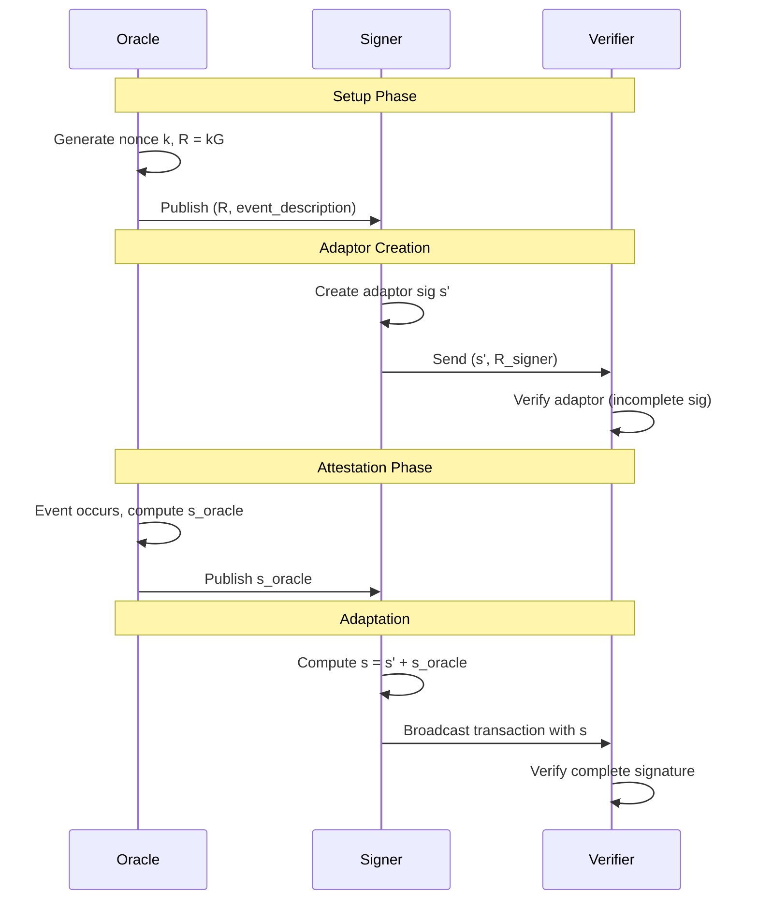

#### Security Properties

1. **Binding**: The adaptor signature commits to a specific oracle attestation
2. **Hiding**: Without the oracle attestation, the adaptor signature is computationally indistinguishable from random
3. **Extractability**: Given adapted signature and adaptor, oracle secret can be extracted (accountability)

### Oracle Multisig: Standard Multi-Party ECDSA/Schnorr

Firefish uses a 3-of-3 multisig where all parties must sign each transaction.

#### Construction (MuSig2 style for Schnorr)

Given three signers with keys `(P_1, P_2, P_3)`:

1. **Key Aggregation**: Compute aggregate key `P_agg = a_1*P_1 + a_2*P_2 + a_3*P_3` where `a_i` are challenge coefficients

2. **Nonce Exchange**: Each signer generates nonces and exchanges commitments

3. **Partial Signatures**: Each signer produces `s_i = k_i + c * a_i * x_i`

4. **Aggregation**: Final signature `s = s_1 + s_2 + s_3`

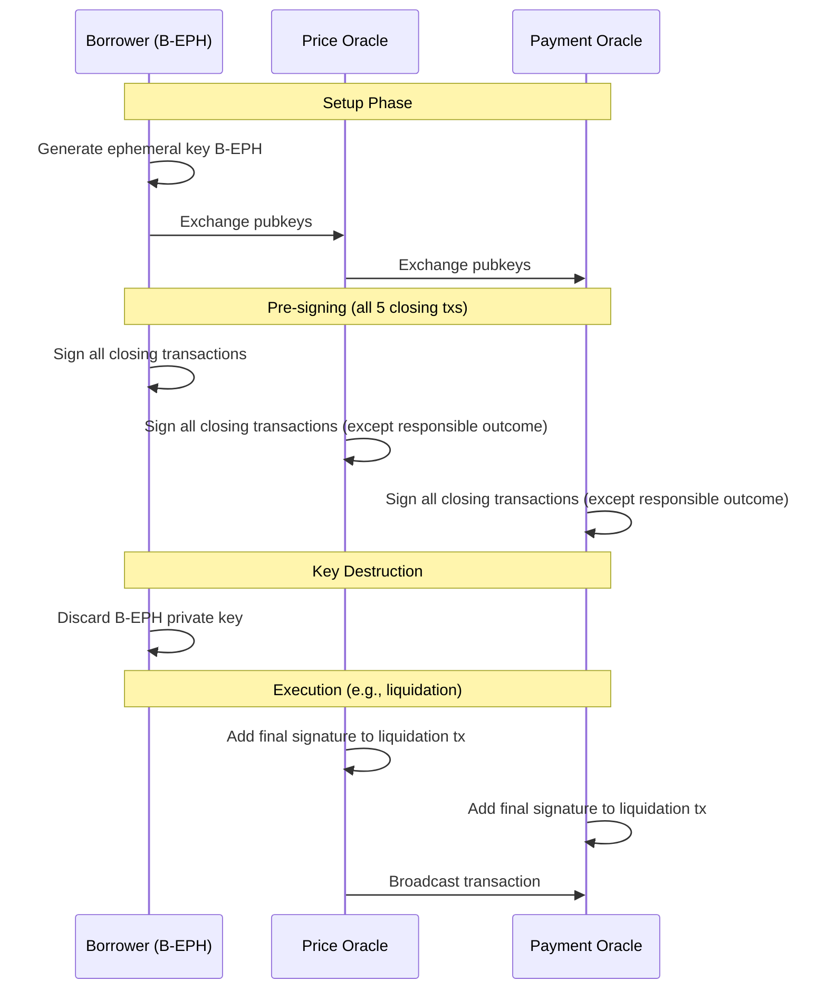

#### Security Properties

1. **Threshold security**: All 3 parties must cooperate (no 2-of-3 spending)
2. **Non-repudiation**: Signed transactions are valid Bitcoin transactions
3. **Key deletion binding**: Once B-EPH is deleted, borrower cannot sign new transactions

---

## Transaction Flow Analysis

### DLC Transaction Structure

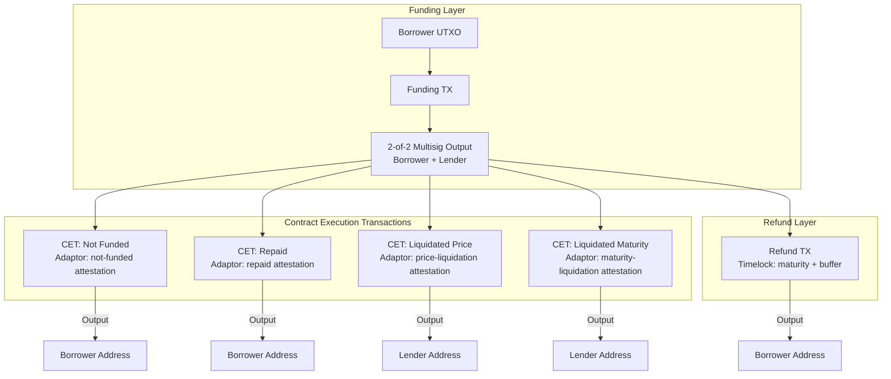

#### CET Spending Conditions

Each CET has the spending condition:
```
<borrower_sig> <lender_sig>
OP_CHECKMULTISIG
```

Where both signatures are adaptor signatures that require the oracle's attestation to become valid.

#### Adaptor Signature Binding

For the liquidation CET:
```
adaptor_sig_borrower = sign_adaptor(tx_liquidation, oracle_pubkey, "liquidated-by-price")
adaptor_sig_lender = sign_adaptor(tx_liquidation, oracle_pubkey, "liquidated-by-price")
```

These become valid signatures only when oracle publishes `attest("liquidated-by-price")`.

### Oracle Multisig Transaction Structure

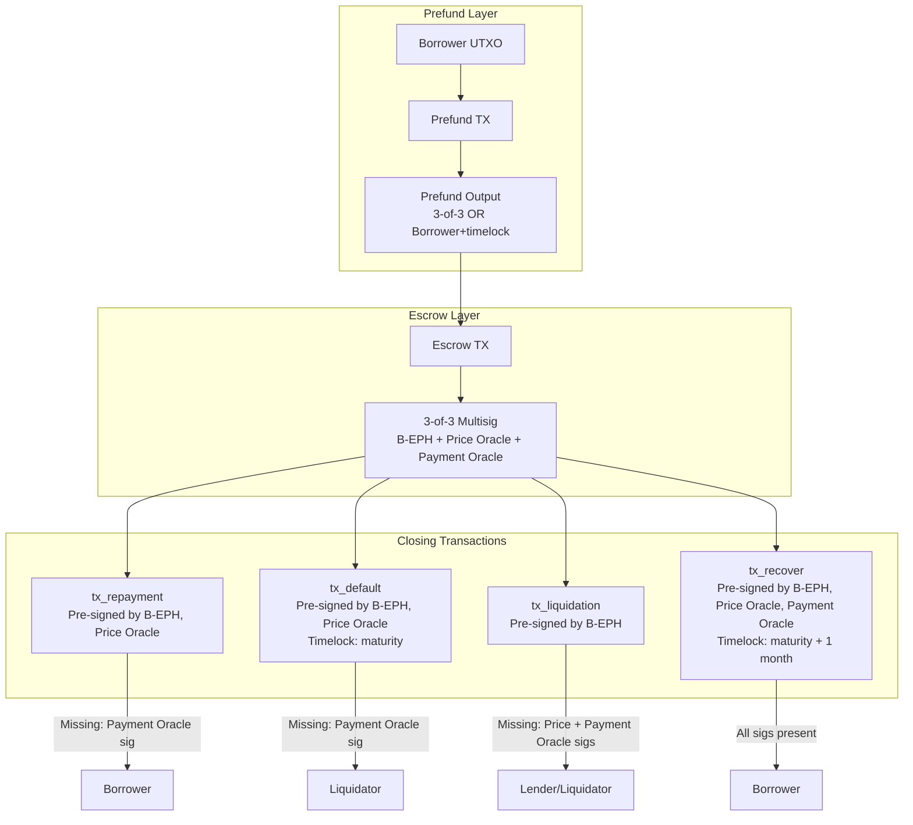

#### Escrow Spending Conditions

The escrow output script:
```
OP_3 <B-EPH_pubkey> <price_oracle_pubkey> <payment_oracle_pubkey> OP_3 OP_CHECKMULTISIG
```

All three keys must sign for any spend (until B-EPH is discarded, after which only pre-signed transactions are valid).

#### Pre-signing Matrix

| Transaction | B-EPH | Price Oracle | Payment Oracle | Missing at Execution |
| ----------- | ----- | ------------ | -------------- | -------------------- |
| tx_repayment | ✓ | ✓ | - | Payment Oracle |
| tx_default | ✓ | ✓ | - | Payment Oracle |
| tx_liquidation | ✓ | - | - | Price Oracle, Payment Oracle |
| tx_recover | ✓ | ✓ | ✓ | None (timelock only) |

---

## Security Model Comparison

### Trust Assumptions

#### DLC Model

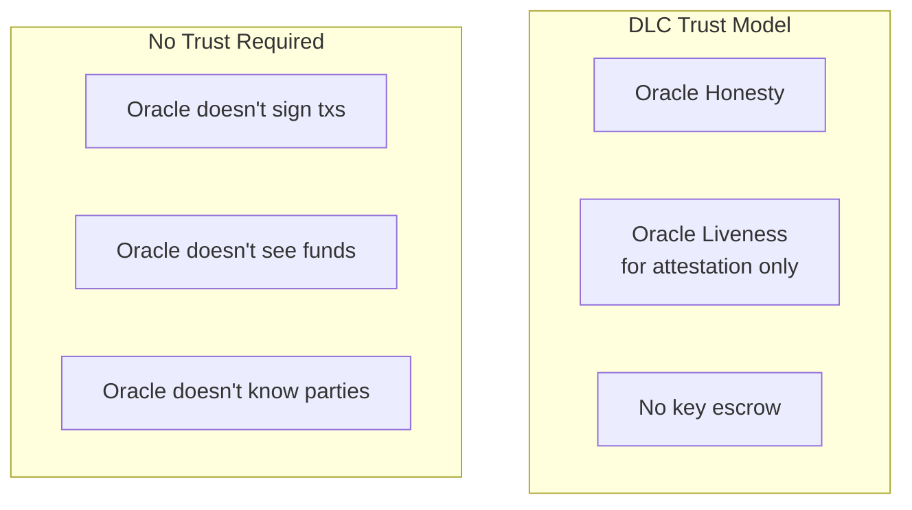

**Trust required:**
- Oracle attests honestly to events
- Oracle is available to publish attestations

**No trust required:**
- Oracle cannot steal funds (doesn't have keys)
- Oracle cannot direct funds (predetermined CETs)
- Oracle cannot selectively withhold (refund exists)

#### Oracle Multisig Model

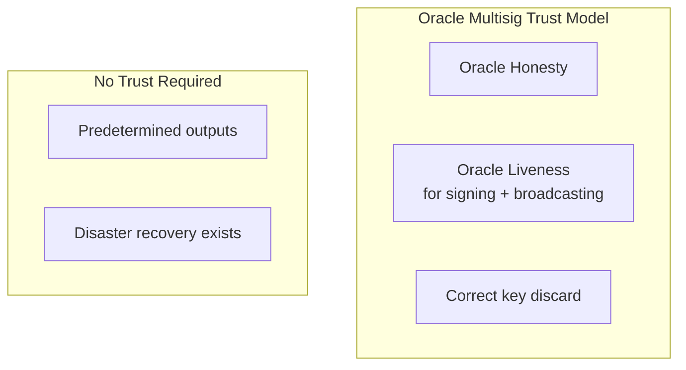

**Trust required:**
- Oracle signs and broadcasts promptly
- Oracle signs the correct transaction
- Borrower correctly discards B-EPH

**No trust required:**
- Funds go to predetermined addresses
- Recovery available if oracles fail

### Attack Surface Analysis

#### DLC Attack Vectors

| Attack | Mitigation |
| ------ | ---------- |
| Oracle attests wrong outcome | Accountability via signature extraction |
| Oracle offline | Timelock refund CET |
| Borrower/Lender key compromise | Funds at risk (2-of-2 property) |
| Oracle key compromise | Oracle cannot move funds directly |

#### Oracle Multisig Attack Vectors

| Attack | Mitigation |
| ------ | ---------- |
| Oracle signs wrong tx | Predetermined outputs limit damage |
| Oracle offline | Disaster recovery (maturity + 1 month) |
| Oracle collusion | 2-of-3 threshold... wait, it's 3-of-3 |
| B-EPH not discarded | Borrower could sign alternative txs |
| B-EPH discarded early | Funds stuck until disaster recovery |

### Collusion Resistance

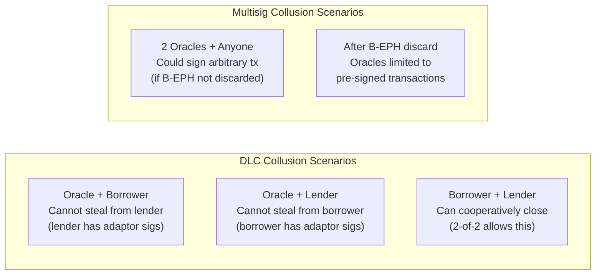

---

## Liveness Requirements

### Who Must Be Online When?

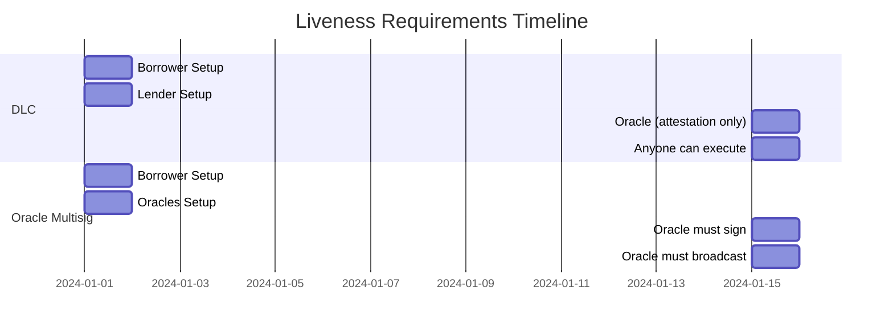

#### DLC Liveness Matrix

| Phase | Borrower | Lender | Oracle | Watchtower |
| ----- | -------- | ------ | ------ | ---------- |
| Setup | Online | Online | Announcement only | N/A |
| Funding | Signs tx | Signs tx | N/A | N/A |
| During loan | Offline OK | Offline OK | N/A | N/A |
| Execution | Offline OK | Offline OK | Publish attestation | Can execute |

#### Oracle Multisig Liveness Matrix

| Phase | Borrower | Price Oracle | Payment Oracle |
| ----- | -------- | ------------ | -------------- |
| Setup | Online | Online | Online |
| Escrow creation | Signs, discards key | Signs | Signs |
| During loan | Offline OK | N/A | N/A |
| Execution | N/A (key gone) | Must sign | Must sign |
| Broadcast | N/A | Must broadcast | Must broadcast |

### Watchtower Compatibility

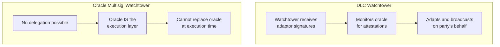

**DLC watchtower protocol:**
1. Party shares adaptor signatures with watchtower
2. Watchtower monitors oracle feed
3. On relevant attestation, watchtower adapts signatures
4. Watchtower broadcasts transaction
5. Original party doesn't need to be online

**Oracle multisig limitation:**
- Oracle must sign at execution time
- Cannot delegate to third party
- Oracle unavailability = execution delayed

---

## Privacy Analysis

### Information Leaked to Oracle

#### DLC Information Flow

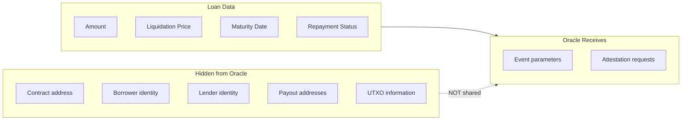

#### Oracle Multisig Information Flow

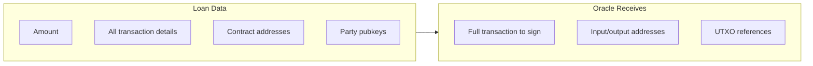

### On-Chain Fingerprint

| Aspect | DLC | Oracle Multisig |
| ------ | --- | --------------- |
| Funding output | 2-of-2 multisig (common) | 3-of-3 multisig (less common) |
| Distinguishability | Similar to Lightning channels | More unique fingerprint |
| Output count | Single output per CET | Single output per closing tx |

---

## Multi-Oracle Extensibility

### DLC Disjoint Union

DLCs support combining multiple oracle attestations without coordination:

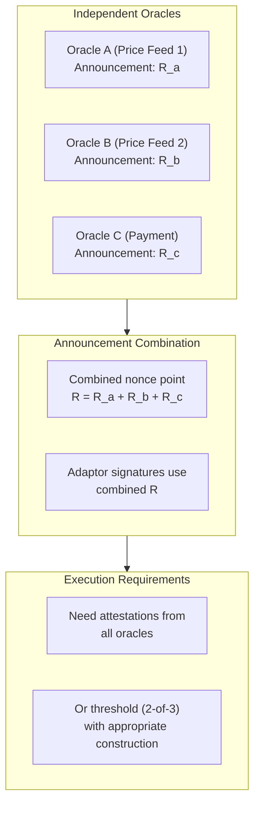

**Properties:**
- Oracles don't need to communicate
- Oracles don't know about each other
- Oracles don't know if their attestations are used
- Flexible threshold schemes possible

### Oracle Multisig Multi-Party

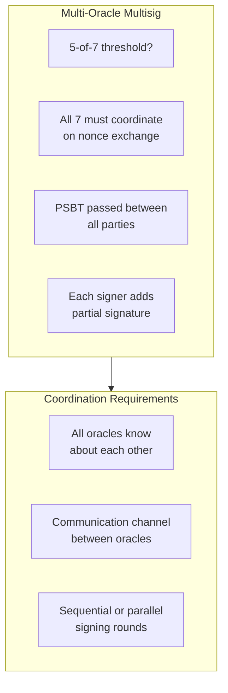

**Challenges:**
- All signers must coordinate nonces
- Communication channel required
- Signing protocol complexity increases with n
- Easier for signers to collude (already coordinating)

---

## Failure Mode Analysis

### Complete Failure Recovery

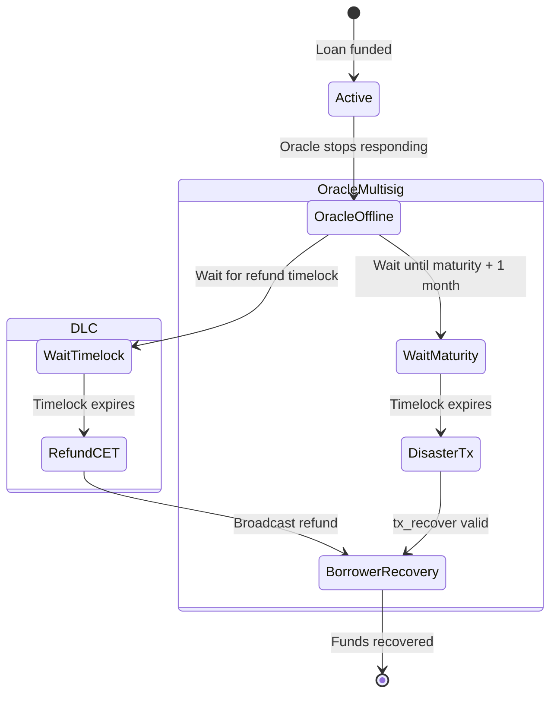

### Partial Failure Scenarios

| Scenario | DLC Outcome | Oracle Multisig Outcome |
| -------- | ----------- | ----------------------- |
| Price Oracle offline | Wait for recovery timelock | Wait for disaster recovery |
| Payment Oracle offline | Wait for recovery timelock | Wait for disaster recovery |
| Borrower key lost | Lender can still execute CETs | No impact (key already discarded) |
| Lender key lost | Borrower can still execute CETs | No impact (not a signer) |
| Attestation never published | Refund CET after timelock | Disaster tx after timelock |

---

## Implementation Complexity

### DLC Implementation Requirements

```
- Adaptor signature library
- Oracle announcement parsing
- CET construction for each outcome
- Signature adaptation logic
- Refund transaction construction
```

### Oracle Multisig Implementation Requirements

```
- Multi-party signing coordination
- Ephemeral key generation and secure deletion
- Pre-signing protocol for all closing txs
- Timelock management
- PSBT handling for oracle signing
```

### Comparative Complexity

| Component | DLC | Oracle Multisig |
| --------- | --- | --------------- |
| Cryptographic primitives | Adaptor signatures | Standard multisig |
| Key management | Standard (no deletion) | Ephemeral key lifecycle |
| Pre-signing | 4 CETs with adaptors | 5 closing txs with partial sigs |
| Execution | Local adaptation | Oracle signing protocol |
| Oracle integration | Announcement + attestation | Signing service |

---

## Summary

### Cryptographic Trade-offs

| Dimension | DLC | Oracle Multisig |
| --------- | --- | --------------- |
| Signature scheme | Adaptor signatures | Standard ECDSA/Schnorr |
| Oracle role | Attestation (passive) | Signing (active) |
| Key management | Standard | Ephemeral + deletion |
| Execution | Anyone can adapt | Oracle must sign |
| Multi-oracle | Disjoint union (simple) | n-of-m multisig (complex) |

### Security Trade-offs

| Dimension | DLC | Oracle Multisig |
| --------- | --- | --------------- |
| Oracle trust | Honesty for attestation | Honesty + availability for signing |
| Key compromise risk | 2-of-2 = both needed | 3-of-3 + key discard |
| Collusion resistance | Adaptor sigs limit damage | Pre-signed txs limit damage |
| Recovery mechanism | Timelock CET | Disaster tx |

### Operational Trade-offs

| Dimension | DLC | Oracle Multisig |
| --------- | --- | --------------- |
| Liveness requirements | Oracle: attestation only | Oracle: sign + broadcast |
| Watchtower support | Yes | No |
| Privacy from oracle | On-chain data hidden | Oracle signs all details |
| Top-up flexibility | Oracle update possible | Requires new contract |

---

*For implementation details, refer to the [DLC Specification](https://github.com/discreetlogcontracts/dlcspecs) and [Firefish Protocol Documentation](https://docs.firefish.io/firefish-protocol).*

*See also: [DLCs are perfect for Lending](/posts/dlc-are-perfect-for-lending/) for Lygos's enumerated outcome approach.*
