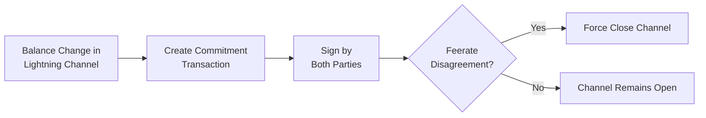
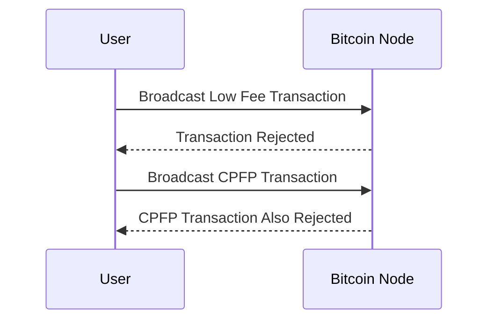
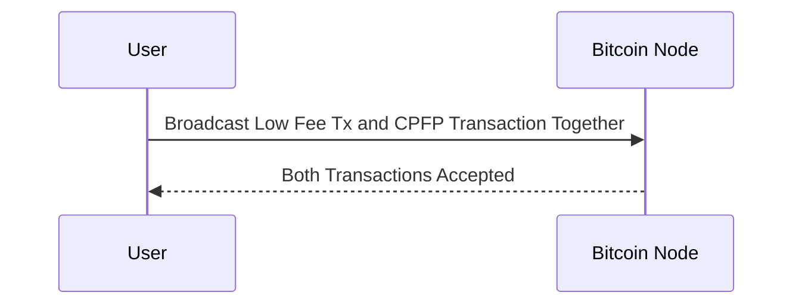

## 📈 The feerate spike

On August 22, 2024 11:38 AM UTC, feerates skyrocketed again, causing the median cost per bitcoin transaction to spike to over $100.

This was likely caused by the Babylon staking announcement, which encouraged users to [**stake their BTC to earn yield**](https://twitter.com/babylonlabs_io/status/1827039016098672672) in a **"non-custodial manner"** (this warrants it's own post), with a limited number of slots available. There was only **12,720 0.05 BTC slots available**, first come, first serve. It's estimated it'd take around 6 blocks of blockspace to fill all the slots. This prompted a rush of users to create on-chain transactions in a very short period of time.

## 🤬 Brutal User Experience

These high fees led to plenty of lightning nodes experiencing force closures. This is caused by a implementation detail of the lightning protocol where if you and your peer disagree on the feerate, the default behavior is to force close the channel.

However, your average Lightning user is likely not aware of this behavior. Front end wallets like [Alby](https://getalby.com/), [Phoenix](https://phoenix.acinq.co/), and [Zeus](https://zeusln.com/) abstract away the underlying complexity of the Lightning protocol, so users are not aware of the underlying mechanics.

In the wake of the chaos, one [Alby](https://getalby.com/) user ran to [stacker news](https://stacker.news/items/658124) ask for help with his situation since **they were unsure if their funds were lost**.

For anyone that is familiar with the Lightning protocol, it is immediately clear that the funds are safe, and the channel was simply force closed due to the feerate disagreement caused by the high fees spike.

However, for the user this isn't obvious at all. **Imagine being a user, being informed that:**

> "Hey there felipe! So lots of people were using Bitcoin and we had to shut down your channel. No worries, your BTC will be back in 14 days! Meanwhile, enjoy using the payment network without any capital"
{: .prompt-warning }

This is such a terrible user experience it's not even funny. And it begs the question: [**is there a way to improve lightning so that force closes don't happen every time a spike in mempool feerate spike occurs?**](https://x.com/matthewjablack/status/1826741851178832318)

## ⚡️ Improvements on the horizon

Each time the balance changes in a lightning channel, a [commitment transaction](https://bitcoinops.org/en/topics/anchor-outputs/) is created and signed by both parties. This transaction can be broadcasted on-chain in case of a dispute or if the other party becomes unresponsive.

The issue with the original channel protocol is that it requires on-chain fees to be committed upfront. On-chain fees are necessary to allow either side to **unilaterally close the channel** without contacting the other side, for example, if the other side disappears or refuses all forwards.

If one side specifies an on-chain fee that the other side thinks is too high, too much of the channel funds will be spent on fees instead of being split by both parties. Conversely, if the fee is too low, the unilateral close **cannot confirm**, and the party wanting to exit **cannot recover their funds**. This disagreement on what on-chain feerate is reasonable can lead to both sides having a problem. The protocol specifies that they should broadcast on-chain because it's the only way to resolve the disagreement.

Since the commitment transaction may be broadcast long after it was created, both parties need to estimate the future feerate. If they estimate too low, either party can bump the fee using [CPFP (Child Pays For Parent)](https://bitcoinops.org/en/topics/cpfp/) to get their transaction confirmed. However, if the feerate is below the [minimum relay feerate](https://btcinformation.org/en/glossary/minimum-relay-fee) (the dreaded purging rate), the transaction will be rejected by the Bitcoin network. In this case, you can't bump the fee because the original transaction won't be accepted, and the [CPFP](https://bitcoinops.org/en/topics/cpfp/) transaction will also be rejected since it's spending from a transaction that doesn't exist.

Basically your Bitcoin node is stupid and doesn't understand that you're trying to broadcast two transactions that are related and need to be accepted or rejected together.

Luckily, there are some improvements on the horizon that will fix this.

### 📦 Package Relay

The basic idea with [package relay](https://bitcoinops.org/en/topics/package-relay/), is to stop your Bitcoin node from being stupid. In exact terms, it's to allow your Bitcoin node to accept a package of transactions at once, instead of processing them one at a time.

With package relay, lightning nodes don't need to guess the future feerate. In fact, they can set the feerate to 0, knowing that they can broadcast the commitment transaction and the [CPFP](https://bitcoinops.org/en/topics/cpfp/) transaction together at a later time. These new 0 feerate commitments are known as [anchor outputs](https://bitcoinops.org/en/topics/anchor-outputs/) or "anchor commitments".

### ⏰ Timeline

**EDIT:** Support for one-parent-one-child (1p1c) package relay is merged in the master branch of [Bitcoin Core](https://github.com/bitcoin/bitcoin/pull/27463), so it'll be released with Bitcoin Core 28.0.

**EDIT2**: In 1p1c, the parent still needs to beat the minimum relay feerate. However it can be below the mempools dynamic minimum feerate (the purging rate). Therefore the commitment transaction needs to pay 1 sat/vB (thanks @murch)

> Unfortunately package relay is not in the Bitcoin Core release pipeline [yet](https://github.com/bitcoin/bitcoin/issues/27463). Hopefully there is a release candidate next month that has package relay. After that folks will need to start updating their Bitcoin nodes, and lightning implementations will need to be updated to support it. This means months, likely a year or more before package relay is reliable enough for everyone to switch to 0-fee commitment txes in their anchor commitment channels.

### 🔮 Package Relay for DLCs

Package relay is also incredibly useful for DLCs as well. Since a DLC on-chain is very similar to a lightning channel, and both parties must pre-commit to execution and refund transactions, package relay will allow either party to fee bump the execution transaction without worrying about the minimum relay feerate.

## Conclusion

Package relay will significantly reduce the risk of force closures due to feerate disagreements. By allowing transactions to be bundled and relayed together, it ensures that even if the initial transaction has a low fee, it can still be confirmed along with its child transaction. This improvement will make the Lightning Network more robust and user-friendly, as users won't have to worry about their channels being force closed due to sudden fee spikes.

Hopefully in a couple years, brutal user experience of `felipe` will be a thing of the past 🤞

## Credits

Special thanks to [@niftynei](https://x.com/niftynei/status/1826782262140014811), [@roasbeef](https://x.com/roasbeef/status/1826746092190663053), [@jxpcsnmz](https://x.com/jxpcsnmz/status/1826748241037459515), and [@murchandamus](https://x.com/murchandamus/status/1827884828559052903) for their helpful breakdown of the issue, and the proposals that will help fix it, that inspired this post.

You can view their helpful responses within the original [x post](https://x.com/matthewjablack/status/1826741851178832318).
