*This post explores the unique technical approach Lygos Finance takes with DLC-based lending, specifically our decision to use enumerated outcomes instead of numeric payout curves.*

---

When we built Atomic Finance, we implemented DLCs the way most people think about them: with numeric payout curves that represent every possible outcome. For options contracts and derivatives, you'd create thousands of pre-signed transactions to cover every potential price point. The math was elegant, but the user experience wasn't.

It would take one to two minutes just to enter a contract. The computational overhead of generating all those adaptor signatures was significant. And for users trying to verify what they were signing? Good luck parsing through thousands of potential outcomes.

When we started building Lygos Finance for DLC-based lending, we took a step back and asked: do we actually need all that complexity?

## The Insight: Loans Have Simple Outcomes

For a Bitcoin-collateralized loan, there are really only four things that can happen to your collateral:

```mermaid
flowchart LR
    subgraph Outcomes["Four Possible Outcomes"]
        A[🔓 Repaid]
        B[📉 Liquidated by Price]
        C[⏰ Liquidated by Maturity]
        D[❌ Not Funded]
    end

    Collateral[Bitcoin Collateral] --> A
    Collateral --> B
    Collateral --> C
    Collateral --> D

    A --> Borrower[Returns to Borrower]
    B --> Lender[Goes to Lender]
    C --> Lender
    D --> Borrower
```

That's it. Four outcomes.

In the past, DLC implementations would create numeric payout curves with signatures for every possible price point. But for lending, we don't need a complex curve mapping price to payout ratio. We need binary decisions: was the loan funded? Did the borrower repay? Did the price cross the liquidation threshold? Did the loan mature unpaid?

## Enumerated vs. Numeric DLCs

Traditional numeric DLCs work like this: you define a payout function that maps oracle-attested values (like BTC price) to how funds should be distributed. The protocol generates adaptor signatures for every point on that curve—potentially thousands or tens of thousands of signatures.

```mermaid
flowchart TB
    subgraph Numeric["Numeric DLC (Traditional)"]
        direction TB
        N1[Define Payout Curve] --> N2[Generate Signatures<br/>for Every Price Point]
        N2 --> N3[1,000+ Adaptor Signatures]
        N3 --> N4[⏱️ 1-2 min setup time]
    end

    subgraph Enumerated["Enumerated DLC (Lygos)"]
        direction TB
        E1[Define 4 Outcomes] --> E2[Generate 4 Signatures]
        E2 --> E3[4 Adaptor Signatures]
        E3 --> E4[⚡ ~5 sec setup time]
    end
```

Enumerated DLCs are simpler: you define discrete outcomes, and the oracle attests to which outcome occurred. For our four-outcome model, the oracle simply attests "not-funded", "repaid", "liquidated-by-price", or "liquidated-by-maturity".

The difference in practice is dramatic:

| Metric | Numeric DLC | Enumerated DLC |
|--------|-------------|----------------|
| Setup time | 1-2 minutes | ~5 seconds |
| Signatures | 1,000+ | 4 |
| User verification | Complex curve | 4 clear outcomes |
| Hardware wallet support | Impractical | Possible |

## How the DLC Loan Works

Here's the complete flow of a Lygos DLC loan:

## Making It Easy to Verify

One of the biggest advantages of this approach is transparency. When you're entering a DLC loan with Lygos, you can look at exactly four pre-signed transactions and understand precisely what happens to your Bitcoin in each case.

```mermaid
flowchart LR
    subgraph Verification["What You're Signing"]
        TX1["TX 1: If not funded (48h) → Your address"]
        TX2["TX 2: If repaid → Your address"]
        TX3["TX 3: If price liquidation → Lender address"]
        TX4["TX 4: If maturity liquidation → Lender address"]
        TX5["TX 5: Refund (timelock) → Your address"]
    end
```

Compare this to a numeric DLC where you'd need to verify the correctness of a complex payout curve across thousands of potential outcomes. The enumerated model makes it trivial for borrowers to verify: "In this scenario, my Bitcoin goes here. In that scenario, it goes there."

It's also much easier to verify Oracle behavior. With four discrete outcomes, you can easily check whether the Oracle attested correctly to the actual outcome. Did the lender fail to fund within 48 hours? The Oracle should attest "not-funded". Did you repay the loan? The Oracle should attest "repaid". Did the price cross the liquidation threshold? The Oracle should attest "liquidated-by-price". There's no ambiguity about interpolation along a curve or rounding at boundary conditions.

## The Oracle Advantage

The enumerated approach also changes how the Oracle operates. Instead of needing to attest to precise price values and having the DLC derive payouts from a curve, our Oracle (Magnolia) simply needs to attest to which of the four events occurred.

```mermaid
flowchart TB
    subgraph Oracle["Oracle Responsibilities"]
        direction LR
        O[Magnolia Oracle]
    end

    subgraph Events["Events to Monitor"]
        E0[Loan funded within 48h?]
        E1[USDC repayment received?]
        E2[Price crossed liquidation threshold?]
        E3[Maturity date passed?]
    end

    subgraph Privacy["What Oracle Does NOT Know"]
        P1[❌ Borrower identity]
        P2[❌ Lender identity]
        P3[❌ Contract addresses]
        P4[❌ Payout addresses]
    end

    Events --> Oracle
    Oracle -.-> Privacy
```

This makes the Oracle's job cleaner: observe whether the loan was funded within 48 hours, whether the loan was repaid (by checking stablecoin transactions), whether the price crossed the liquidation threshold, or whether the maturity date passed with an unpaid balance. No complex calculations, just straightforward event attestation.

The Oracle doesn't need to know who the borrower and lender are. They don't need to know the contract addresses or payout addresses. They just need to publish attestations for the loan outcomes, which either party can use to unlock the DLC.

## DLC vs. Multi-sig Arbiter

Why not just use a 2-of-3 multi-sig with an arbiter? Here's how they compare:

```mermaid
flowchart TB
    subgraph Multisig["2-of-3 Multi-sig with Arbiter"]
        direction TB
        M1[Borrower Key]
        M2[Lender Key]
        M3[Arbiter Key]
        M1 & M2 & M3 --> MOut[2-of-3 required to spend]
        MOut --> MProb[⚠️ Arbiter knows all parties<br/>⚠️ Arbiter decides at execution time<br/>⚠️ Hard to scale to multiple arbiters]
    end

    subgraph DLC["DLC with Oracle"]
        direction TB
        D1[Borrower Key]
        D2[Lender Key]
        D1 & D2 --> DOut[2-of-2 + pre-signed outcomes]
        DOut --> DAdv[✅ Oracle doesn't know parties<br/>✅ Outcomes pre-defined<br/>✅ Easy to add multiple oracles]
    end
```

With an arbiter system, at the time of execution, the arbiter needs to make a judgment call: what actually happened? They need to communicate with the parties, evaluate evidence, and actively sign a transaction. This introduces timing risk and trust in the arbiter's judgment.

With DLCs, the Oracle simply attests to objective facts. The outcome transactions are already pre-signed—the Oracle's attestation just reveals which one is valid.

## Preserving DLC Benefits

Despite the simplification, we maintain all the core benefits of DLCs:

- **Non-custodial**: The Bitcoin sits in a 2-of-2 multisig between borrower and lender, with pre-signed outcome transactions
- **Privacy**: The Oracle doesn't know the contract parties, and on-chain the transaction looks like any other 2-of-2 multisig (similar to a Lightning channel)
- **Refund path**: If both Lygos and the Oracle disappear, there's still a time-locked refund transaction that returns your Bitcoin
- **Cooperative flexibility**: Since it's fundamentally a 2-of-2 multisig, borrowers and lenders can cooperatively modify terms, add collateral, or roll over loans

## Why This Matters for Scale

The enumerated approach isn't just a nice optimization—it's what makes DLC lending practical at scale.

```mermaid
flowchart LR
    subgraph Before["Before: Numeric DLCs"]
        B1[Mobile App Only] --> B2[Long Setup Times]
        B2 --> B3[Limited Adoption]
    end

    subgraph After["After: Enumerated DLCs"]
        A1[Hardware Wallets ✅]
        A2[Institutional Custody ✅]
        A3[Mobile Apps ✅]
        A1 & A2 & A3 --> A4[Broader Adoption]
    end
```

With adaptor signatures being computationally intensive, limiting ourselves to four of them means we can run on hardware wallets and integrate with institutional custody solutions. We're not asking a Ledger to grind through thousands of signatures; we're asking it to sign four transactions.

This opens up DLC lending to borrowers who (rightfully) don't want to keep private keys for significant amounts of Bitcoin on an internet-connected device. It opens integration with custodians who can now offer DLC-based products to their clients.

## Looking Forward

The four-outcome enumerated model works well for bilateral lending. It's simple, verifiable, and fast.

If Bitcoin ever gets covenant opcodes like CTV or TXHASH, those complex payout curves could become practical again—you wouldn't need to pre-sign thousands of transactions because the covenant would enforce the payout function directly. But for now, with Bitcoin as it exists today, the enumerated approach is the right tool for lending.

Sometimes the best technical solution isn't the most complex one. For DLC-based lending, four outcomes is all you need.

---

*Learn more about Lygos Finance at [lygos.finance](https://lygos.finance) or follow [@LygosFinance](https://twitter.com/LygosFinance) on Twitter.*
