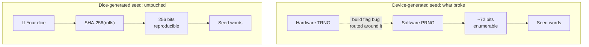
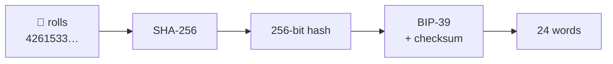

*A five year old firmware bug has cost people at least 1,400 BTC and counting. The one seed-generation method that came through untouched was the one where a human rolled dice on a table. Here's how to do it properly, including a formatting trap that will hand you a completely different wallet and convince you you've been hacked.*

> **This is the technical version.** It gets into entropy maths, hash functions and source code. If you just want the steps (buy dice, roll them, write them down correctly), read [Rolling Dice for Your Bitcoin Wallet: The Simple Guide]() instead. You won't miss anything you need in order to do this safely.
{: .prompt-info }

> **Correction, 5 August 2026.** This post previously said Krux hashes dice rolls differently from Coldcard and SeedSigner, and so produces a different seed from the same dice. That was wrong. Krux dropped the separator for D6 in v22.08.0 in August 2022; I was citing a thread from a month earlier and missed the fix. The companion post carried the same error, along with a worked example built on that outdated description rather than on Krux's actual output. [Full correction and how I checked it properly this time](). Thanks to [@matijaoe](https://x.com/matijaoe) for the catch.
{: .prompt-warning }

---

## 🎲 Why everyone is suddenly asking about dice

On July 30, 2026, roughly 1,083 BTC left ~1,196 addresses in about 41 minutes. The number has kept climbing since. As of August 5, [Coldcard Sweep Watch](https://coldcardwatch.com/) puts the **verified** total at **~1,403 BTC**, every address checked transaction by transaction, and a further **~2,055 BTC across roughly 7,700 addresses** in the *suspected* set, which [Galaxy Research](https://x.com/intangiblecoins) rates medium-high confidence without victim confirmation yet.

Take the verified number as a floor rather than a total, which is how the trackers themselves frame it: undiscovered clusters are near certain, and other attackers are working the same flaw with their own patterns. Nobody touched a single physical device.

The cause was a build flag. When Coinkite migrated Coldcard's elliptic-curve work to `libsecp256k1` in March 2021, seed generation moved from `ckcc.rng_bytes()` to `ngu.random.bytes()`. Both had identical signatures, so nothing complained. But the guard selecting the implementation looked like this:

```c
#ifndef MICROPY_HW_ENABLE_RNG
```
{: file="the $88M line" }

`#ifndef` tests whether a macro is **defined**, not whether it's **nonzero**. The macro was defined, with a value of `0`. So the build quietly took the fallback branch and wired seed generation to MicroPython's software PRNG instead of the STM32 hardware RNG.[^backgrounder]

The result: **~40 bits** of effective entropy on Mk2/Mk3, **~72 bits** on Mk4/Mk5/Q, where 128 or 256 was intended. That's enumerable offline. An attacker never needs your device. They grind candidate seeds, derive addresses, and check them against the chain.

> Bitcoin was never broken here. `SHA256` was never broken. A preprocessor directive was wrong, and five years of "air-gapped" seeds were computable the whole time.
{: .prompt-danger }

Here's the part that matters for this post. From Coinkite's own advisory:

> "If you added at least 50 fair, independent, private dice rolls when originally creating the seed... **We do not consider that seed at risk from this RNG issue alone.**"
{: .prompt-tip }

Dice survived. Not because Coldcard's dice code was better written, but because **dice don't go through the RNG at all**.

## 🔑 What dice actually buy you

Every hardware wallet asks you to trust a number you cannot see, produced by a chip you cannot audit, running firmware you probably didn't build from source. The entire security of your wallet rests on that number being unpredictable, and you have no way to check.

Dice change the question. You are not verifying that the device's randomness was good. **You are supplying the randomness yourself**, and the device's only job is arithmetic you can reproduce on any computer.



The whole dice pipeline is four steps, and every one of them is something you can redo yourself on a machine you control:



That reproducibility is the entire point. If your device shows you different words than your own `sha256sum` does, you have caught it lying.

## 🧮 How many rolls?

Here is where nearly every guide goes wrong, including some of the official docs.

A six-sided die carries `log2(6) = 2.585` bits. Fifty rolls is 129.2 bits, which clears the 128 bits a 12-word seed needs. A hundred rolls is 258.5 bits, clearing the 256 a 24-word seed needs. That's the whole calculation, and it holds for every tool that hashes your rolls, which, as we'll see, is all of the common ones by default.

Drag this:

<div class="dice-calc" id="dice-calc">
  <div class="dc-row">
    <label class="dc-label" for="dc-rolls">Dice rolls</label>
    <output class="dc-count" id="dc-count">100</output>
  </div>
  <input type="range" id="dc-rolls" min="0" max="200" value="100" step="1" class="dc-slider">
  <div class="dc-row">
    <label class="dc-label" for="dc-bias">Most common face</label>
    <output class="dc-count" id="dc-bias-count">16.7% (fair)</output>
  </div>
  <input type="range" id="dc-bias" min="166" max="500" value="166" step="1" class="dc-slider">
  <p class="dc-note dc-hint">How often the die's favourite face lands. A fair die is 16.7%, one in six. Drag right to pretend your die is loaded, and watch how many more rolls it takes to get back to a full seed.</p>
  <div class="dc-toggles">
    <div class="dc-group" role="group" aria-label="Mode">
      <button type="button" class="dc-btn is-on" data-tool="hashed">Hashed (default)</button>
      <button type="button" class="dc-btn" data-tool="raw">Raw entropy</button>
    </div>
    <div class="dc-group" role="group" aria-label="Seed length">
      <button type="button" class="dc-btn" data-words="12">12 words</button>
      <button type="button" class="dc-btn is-on" data-words="24">24 words</button>
    </div>
  </div>
  <div class="dc-bar"><span class="dc-fill" id="dc-fill"></span></div>
  <div class="dc-stats">
    <div><span class="dc-k">Entropy in</span><span class="dc-v" id="dc-raw">258.5 bits</span></div>
    <div><span class="dc-k">Actually used</span><span class="dc-v" id="dc-used">256 bits</span></div>
    <div><span class="dc-k">Rate</span><span class="dc-v" id="dc-rate">2.585 bits/roll</span></div>
  </div>
  <p class="dc-verdict" id="dc-verdict">Saturated at exactly 100 rolls.</p>
  <p class="dc-note">Takes a roll <em>count</em> only. Never type actual dice values into a web page, including this one.</p>
</div>

<style>
.dice-calc{--dc-bg:#f6f8fa;--dc-fg:#1b1b1e;--dc-mut:#6b7280;--dc-line:#dfe3e8;--dc-ok:#03b303;--dc-warn:#ef9c03;--dc-bad:#df3c30;--dc-acc:#0070cb;--dc-btn:#fff;
background:var(--dc-bg);color:var(--dc-fg);border:1px solid var(--dc-line);border-radius:.625rem;padding:1.25rem;margin:1.5rem 0}
@media (prefers-color-scheme:dark){.dice-calc{--dc-bg:#1e1f22;--dc-fg:#e6e6e6;--dc-mut:#9aa0a6;--dc-line:#34363b;--dc-ok:#0fa40f;--dc-warn:#ffa500;--dc-bad:#cd0202;--dc-acc:#0075d1;--dc-btn:#26272b}}
html[data-mode=light] .dice-calc{--dc-bg:#f6f8fa;--dc-fg:#1b1b1e;--dc-mut:#6b7280;--dc-line:#dfe3e8;--dc-ok:#03b303;--dc-warn:#ef9c03;--dc-bad:#df3c30;--dc-acc:#0070cb;--dc-btn:#fff}
html[data-mode=dark] .dice-calc{--dc-bg:#1e1f22;--dc-fg:#e6e6e6;--dc-mut:#9aa0a6;--dc-line:#34363b;--dc-ok:#0fa40f;--dc-warn:#ffa500;--dc-bad:#cd0202;--dc-acc:#0075d1;--dc-btn:#26272b}
.dice-calc *{box-sizing:border-box}
.dc-row{display:flex;justify-content:space-between;align-items:baseline;margin-bottom:.4rem}
.dc-label{font-size:.85rem;color:var(--dc-mut);text-transform:uppercase;letter-spacing:.04em}
.dc-count{font-size:1.9rem;font-weight:700;font-variant-numeric:tabular-nums;line-height:1}
.dc-slider{width:100%;margin:0 0 1rem;accent-color:var(--dc-acc)}
.dc-toggles{display:flex;flex-wrap:wrap;gap:.5rem;margin-bottom:1rem}
.dc-group{display:flex;border:1px solid var(--dc-line);border-radius:.5rem;overflow:hidden}
.dc-btn{background:var(--dc-btn);color:var(--dc-mut);border:0;padding:.4rem .8rem;font-size:.85rem;cursor:pointer;font-family:inherit;white-space:nowrap}
.dc-btn+.dc-btn{border-left:1px solid var(--dc-line)}
.dc-btn.is-on{background:var(--dc-acc);color:#fff;font-weight:600}
.dc-bar{height:.6rem;background:var(--dc-line);border-radius:999px;overflow:hidden;margin-bottom:.9rem}
.dc-fill{display:block;height:100%;width:0;background:var(--dc-ok);border-radius:999px;transition:width .12s linear,background .12s linear}
.dc-stats{display:flex;flex-wrap:wrap;gap:.75rem 1.75rem;margin-bottom:.75rem}
.dc-stats>div{display:flex;flex-direction:column}
.dc-k{font-size:.72rem;color:var(--dc-mut);text-transform:uppercase;letter-spacing:.04em}
.dc-v{font-size:1.05rem;font-weight:600;font-variant-numeric:tabular-nums}
.dc-verdict{margin:0 0 .5rem;font-weight:600}
.dc-note{margin:0;font-size:.8rem;color:var(--dc-mut)}
.dc-hint{margin:-.6rem 0 1rem;line-height:1.5}
.dc-tv{margin-top:.75rem}
.dc-det{padding:0}
.dc-det>summary{cursor:pointer;padding:.8rem 1rem;font-weight:600;font-size:.92rem;list-style:none;color:var(--dc-acc)}
.dc-det>summary::-webkit-details-marker{display:none}
.dc-det>summary::before{content:"\25B6";display:inline-block;margin-right:.55rem;font-size:.7em;transition:transform .15s ease}
.dc-det[open]>summary::before{transform:rotate(90deg)}
.dc-det>summary:hover{text-decoration:underline}
.dc-det .dc-body{padding:0 1rem .25rem}
.dc-det .dc-body>p:first-child{margin-top:0}
.dc-hash{font-family:var(--bs-font-monospace,ui-monospace,SFMono-Regular,Menlo,monospace);font-size:.82rem;word-break:break-all;line-height:1.6;margin:.5rem 0}
.dc-hash b{background:rgba(0,112,203,.16);border-radius:3px;padding:.1em 0;font-weight:700}
</style>

<script>
(function () {
  var el = function (id) { return document.getElementById(id); };
  var box = el('dice-calc');
  if (!box) return;

  var RATE = { raw: (4 * 2 + 2 * 1) / 6 };
  var FAIR = 1 / 6;
  var state = { rolls: 100, bias: FAIR, tool: 'hashed', words: 24 };

  /* Min-entropy of one roll: -log2(probability of the most likely face).
     Assumes the attacker knows exactly how the die is loaded.
     Block comments only: compress_html joins these lines in production. */
  function minEntropy(p) { return -Math.log(p) / Math.log(2); }

  function render() {
    var raws = state.tool === 'raw';
    var rate = raws ? RATE.raw : minEntropy(state.bias);
    var target = state.words === 12 ? 128 : 256;
    var raw = state.rolls * rate;
    var used = Math.min(raw, target);
    var need = Math.ceil(target / rate);
    var pct = Math.min(100, (used / target) * 100);

    el('dc-count').textContent = state.rolls;

    var biasEl = el('dc-bias');
    var facePct = (state.bias * 100).toFixed(1) + '%';
    el('dc-bias-count').textContent = raws
      ? 'n/a in raw mode'
      : state.bias <= FAIR
        ? facePct + ' (fair)'
        : facePct + ' (' + (state.bias / FAIR).toFixed(1) + '× fair)';
    biasEl.disabled = raws;
    biasEl.style.opacity = raws ? '0.4' : '';

    el('dc-raw').textContent = raw.toFixed(1) + ' bits';
    el('dc-used').textContent = used.toFixed(1) + ' bits';
    el('dc-rate').textContent = rate.toFixed(3) + ' bits/roll';

    var fill = el('dc-fill');
    fill.style.width = pct + '%';

    var v = el('dc-verdict');
    if (raw >= target) {
      var spare = state.rolls - need;
      fill.style.background = 'var(--dc-ok)';
      v.style.color = 'var(--dc-ok)';
      v.textContent = spare === 0
        ? 'Saturated at exactly ' + need + ' rolls. Every further roll is discarded.'
        : 'Saturated. ' + spare + ' roll' + (spare === 1 ? '' : 's') + ' beyond the ' + need + ' needed. Those bits are thrown away.';
    } else {
      var short = target - raw;
      var more = need - state.rolls;
      fill.style.background = short > target / 2 ? 'var(--dc-bad)' : 'var(--dc-warn)';
      v.style.color = short > target / 2 ? 'var(--dc-bad)' : 'var(--dc-warn)';
      v.textContent = short.toFixed(1) + ' bits short. Roll ' + more + ' more (' + need + ' total).';
    }
  }

  box.addEventListener('input', function (e) {
    if (e.target.id === 'dc-rolls') state.rolls = parseInt(e.target.value, 10);
    /* Tenths of a percent; the floor sits just under 1/6 so the left end
       clamps to exactly fair rather than 16.6%. */
    else if (e.target.id === 'dc-bias') state.bias = Math.max(FAIR, parseInt(e.target.value, 10) / 1000);
    else return;
    render();
  });

  box.addEventListener('click', function (e) {
    var b = e.target.closest('.dc-btn');
    if (!b) return;
    var key = b.dataset.tool ? 'tool' : 'words';
    state[key] = b.dataset.tool || parseInt(b.dataset.words, 10);
    Array.prototype.forEach.call(b.parentNode.children, function (s) { s.classList.remove('is-on'); });
    b.classList.add('is-on');
    render();
  });

  render();
})();
</script>

Switch to **Raw entropy** and the numbers collapse. That's not a different tool. It's a different *mode*, and knowing which one you're in is the only genuinely subtle thing on this page.

### The standard construction, and why the tools agree

The construction used by Coldcard, SeedSigner and Keystone alike: accumulate your rolls as an ASCII string and hash them. From Coinkite's public-domain verification script, which is plain Python and needs no hardware at all:

```python
r = input().strip()
h = sha256(r.encode()).digest()      # 24 words
h = sha256(r.encode()).digest()[:16] # 12 words
```
{: file="coldcard.com/docs/rolls.py + rolls12.py" }

iancoleman's tool does the same thing, as long as you pick a word count rather than `Raw`:

```js
if (mnemonicLength != "raw") {
    var hash = sjcl.hash.sha256.hash(entropy.cleanStr);
    var numberOfBits = 32 * mnemonicLength / 3;   // 128 for 12w, 256 for 24w
    bits = bits.substring(0, numberOfBits);
}
```
{: file="src/js/index.js (iancoleman/bip39)" }

Same hash, same truncation. I checked this rather than assuming it. Feeding identical rolls to both implementations produces **byte-identical mnemonics** for 12 and 24 words, including degenerate inputs like fifty 1s and a hundred 6s. I also ran SeedSigner's own published 99-roll test vector through `rolls.py` and got SeedSigner's mnemonic back word for word.

> If a guide tells you these tools produce different seeds from the same dice, it's wrong. Coldcard, SeedSigner, Keystone and iancoleman (in word-count mode) are the same algorithm, and any of them can check any other.
{: .prompt-info }

So the roll count is simply:

> **12 words → roll 50. 24 words → roll 100.**
> `2.585` bits per roll, in both tools. There is no second number to remember.
{: .prompt-tip }

### Where 1.67 bits/roll comes from

iancoleman also has a **`Raw`** mnemonic length, which skips the hash and maps each roll straight to bits using an unbiased extractor: four outcomes give 2 bits, two give 1 bit:[^entropyjs]

```js
"base 6 (dice)": { "0": "00", "1": "01", "2": "10", "3": "11", "4": "0", "5": "1" }
// Average (4*2 + 2*1) / 6 = 1.66 bits per roll without bias
```
{: file="src/js/entropy.js (iancoleman/bip39)" }

That's deliberately conservative. It throws away bits rather than risk modulo bias. But it means raw mode needs **77 rolls** for 128 bits and **154** for 256.

This same 1.67 figure drives iancoleman's on-screen entropy meter, which is why the tool will show you a **weak entropy warning at 50 rolls even though your seed is fine**. Its warning fires when `32 × words / 3` exceeds the *raw* bit count, so it's judging your dice by the standard of an extractor it isn't currently using. Roll 100 and the warning goes away regardless.

> The true entropy of *N* fair d6 rolls is `N × 2.585` bits. That's information theory, not a tool setting. When either tool hashes, that's what you get.
{: .prompt-info }

And note the flip side, which the calculator makes obvious: past saturation, **extra rolls do nothing**. `SHA256` outputs 256 bits and a 12-word seed truncates to 128. Rolling 200 dice for a 12-word seed is 150 rolls of wasted evening. More is not better; enough is enough.

Two footnotes while we're here. Coldcard's docs say 99 rolls for 256 bits, but `99 × 2.585 = 255.9`, a hair under. Round to 100. And a 24-word seed is 256 bits of entropy plus an 8-bit checksum (264 ÷ 11 = 24 words); 12 words is 128 + 4 (132 ÷ 11 = 12). The checksum is computed for you. It is not something you roll.

### How fair do the dice need to be?

Much less fair than you would think. Alex Waltz pushed back on the "buy precision dice" advice further down this page, and he's right: entropy loss from bias is logarithmic, so it takes an absurdly loaded die to matter. He has [been making this argument since 2022](https://x.com/raw_avocado/status/1508196740314374153), from the first page of Shannon's *A Mathematical Theory of Communication*, with worked examples for coins as well as dice. The calculator above now has a bias control so you can check it yourself.

The number it moves is **min-entropy**: `-log2(p)`, where `p` is the probability of the die's most likely face. That's the measure keying material is judged by, and it's deliberately pessimistic. It assumes an attacker who knows exactly how your die is loaded and starts guessing with the likeliest sequence. Shannon entropy would flatter the result. At a face coming up 25% of the time, Shannon still reads 2.553 bits and min-entropy reads 2.000. Worth noting that Waltz's thread argues from Shannon, the classic measure; the numbers below use the stricter one and land in the same place. His case is if anything stronger than he made it.

So, some biases and what they actually cost:

| Most common face | vs fair | Bits per roll | 100 rolls |
|---|---|---|---|
| 16.7% | fair | 2.585 | 258.5 |
| 20% | 1.2× | 2.322 | 232.2 |
| 25% | 1.5× | 2.000 | 200.0 |
| 40% | 2.4× | 1.322 | 132.2 |
| 50% | 3× | 1.000 | 100.0 |

Read the 25% row again. A die landing on one face a quarter of the time is visibly, obviously crooked, and 100 rolls of it still buys you 200 bits. Nobody is brute-forcing 200 bits.

> **A die would have to favour one face 41% of the time before 100 rolls stopped clearing 128 bits.** That is a die you would spot in twenty throws. If your dice are not that broken, and they are not, your seed is fine.
{: .prompt-tip }

There is an honest flip side, and it's the one thing the "cheap dice are fine" argument glosses over. A fair d6 gives exactly `258.5` bits at 100 rolls, which clears 256 with `2.5` bits to spare. That margin is thin enough that *any* real bias puts a 24-word seed a shade under 256. At a 20% face you'd want 111 rolls; at 25%, 128.

Which points at the actual fix. If you're worried about your dice, **roll fifteen more**. That costs two minutes and covers far more bias than precision dice would have removed. Buying better dice to protect a 24-word seed, and then rolling exactly 100, solves the smaller problem.

One caveat on the model: min-entropy depends only on the single likeliest face, so treating one face as heavy and the other five as equal is the worst case for any given level of bias. Real dice spread their bias across opposite-face pairs, which is gentler than the table above.

**Don't try to fix a biased die yourself.** The classic trick, which [opens that same thread](https://x.com/raw_avocado/status/1508194859970174988), is von Neumann debiasing: roll in pairs, throw away ties, take the order of the two as your bit. It works, and you do not need it. Hashing already does the extraction, which is the entire reason a biased die costs you a few rolls instead of your seed.

More importantly, don't. Every tool in the verify section hashes the literal digits you typed. Debiased rolls are [a different string](#-the-formatting-trap), so no second implementation will reproduce your words, and you have destroyed the one check that makes dice worth doing.

## 🚨 The formatting trap

Here is the one that will actually cost someone their coins, and I haven't seen it written down anywhere.

**Coldcard hashes your input verbatim. iancoleman strips everything that isn't a digit 1–6 first.**

That single difference means the two tools agree perfectly on clean input and diverge completely the moment you type a space:

```console
$ echo -n "123456"      | python3 rolls12.py   # Coldcard
mirror reject rookie talk pudding throw happy era myth already payment owner

$ echo -n "1 2 3 4 5 6" | python3 rolls12.py   # Coldcard, spaces included in the hash
ask avoid magnet arctic panther nominee emerge pepper erosion travel snap parrot
```

iancoleman returns `mirror reject rookie…` for **both**, because it discards the spaces before hashing. Coldcard treats `"1 2 3 4 5 6"` as a completely different string, and gives you a completely different wallet.

> Write your rolls in your notebook grouped as `31415 92653 58979` for legibility, type them into the device without spaces, then later verify them *with* spaces, and you will get a different seed and conclude your hardware wallet has been tampered with. It hasn't. You changed the input.
{: .prompt-danger }

There's a related quirk in Coldcard's own verification script. Its low-entropy warning counts **characters, not rolls**:

```python
if len(r) < 99:
    ae = 2.585 * len(r)
```
{: file="rolls.py (len() counts separators too)" }

Six rolls typed as `3 1 4 1 5 9` is 11 characters, so it cheerfully reports 28 bits of entropy when you actually have 15.5. Separators don't just change your seed. They defeat the safety check meant to catch you.

The rule is boring and absolute:

> **Record your rolls as one unbroken run of digits 1–6. No spaces, no line breaks, no grouping, no commas.** Enter them the same way everywhere, every time.
{: .prompt-tip }

## 🎯 How to actually roll

The math is the easy half. The physical half is where people quietly ruin it.

**Whatever dice you have are almost certainly fine.** Cheap board-game dice do have rounded corners and hollowed-out pips, which shifts the center of mass toward the 1, and casino-grade precision dice with flush pips and sharp edges are machined to a thousandth of an inch for about $10. But as [the bias table above](#how-fair-do-the-dice-need-to-be) shows, a die would have to favour one face 41% of the time before 100 rolls stopped clearing 128 bits. Yours doesn't. If you want a hedge that costs nothing, roll fifteen extra rather than waiting on a delivery.

**Roll on a hard flat surface with a wall.** A table with a book at the far end. Dice that tumble and bounce off something randomize far better than dice dropped onto carpet.

**Decide your reading order before you roll.** Left to right, top to bottom. Write it down. If you throw 20 dice at once and then decide how to read them after seeing the result, you have introduced yourself into the process, and you are terrible at being random.

**Never re-roll a result you don't like.** Not the die that fell off the table, not the "too many sixes in a row" run. `666666` is exactly as likely as any other six rolls. Discarding results you find unaesthetic is precisely how you leak entropy.

**Don't arrange the dice.** Roll, read, record, repeat.

> You are not a good source of entropy. Neither is your birthday, a song lyric, or keyboard mashing. The dice are doing the work. Your only job is to not interfere with them.
{: .prompt-warning }

Twenty dice thrown five times gets you to 100 quickly. One die rolled 100 times works identically and is easier to record without losing your place. Both are fine.

**Write the results down as one continuous string of digits**, not in tidy groups. It reads worse, and per the section above it is the single most important formatting decision you'll make here.

## 💻 Where to enter them

Three workable options, in the order I'd reach for them.

**1. A dedicated signer with a verifiable dice mode.** A [SeedSigner](https://seedsigner.com/) is the cleanest option: dice are its *only* entropy source, it has no persistent storage so it forgets everything at power-off, its builds have been reproducible since v0.7.0, and it's ~$50 of parts. `Tools > New Seed (dice icon) > 24 words (99 rolls)`. A Keystone works too and [publishes its own verification guide](https://blog.keyst.one/how-to-verify-the-recovery-phrase-created-by-dice-rolling-af01c16b765e). Both use exactly the construction above, so everything in the verify section applies to them unchanged.

**2. An offline copy of iancoleman's BIP39 tool.** Open [iancoleman.io/bip39](https://iancoleman.io/bip39/), File → Save As, move the file to an air-gapped machine, open it there. Or download the [signed GitHub release](https://github.com/iancoleman/bip39/releases/latest) and verify it first. Use the Entropy field, set the type to dice, and set **Mnemonic Length** to 12 or 24, not `Raw`. In that mode it matches the signers above exactly, and 50/100 rolls is the right target. Ignore the weak-entropy warning at 50 rolls; as covered above, it's measuring raw-mode yield rather than what your dice actually carry.

**3. A Coldcard you already own.** If you have one and you're done with the brand, it is still a perfectly good dice-to-words calculator, because the dice path was never affected by this bug: it never called the broken RNG. `New Seed Words > Advanced > 12 Word Dice Roll` (or `24 Word Dice Roll`), press 1–6 as you roll, write down the words, wipe the device, and import the words into whatever you're using instead.

Note a distinction that applies on any device offering both: a pure **dice roll** mode derives the seed *only* from your rolls, which is what makes it reproducible. An **add dice to device entropy** mode mixes your rolls into the chip's randomness: safe, but you cannot independently verify the result, because half the input came from a chip.

**4. A printed word table, with no device in the entropy path at all.** Instead of handing your rolls to a device and letting it hash them, you roll, look up each word yourself in a printed BIP-39 table, and write down 23 words. The device's only job is computing the 24th checksum word. This is what BitBox02 and Jade do, and it is not a lesser variant of the options above: it is the only one where nothing you cannot see ever touches your entropy. [Why that matters, and how you verify it](#-verifying-without-a-computer), below.

The unlock most people miss: **BitBox publishes the lookup table as a free PDF and you do not need to own a BitBox to use it.** Print [the table](https://bitbox.swiss/bitbox02/BitBox_Diceware_LookupTable.pdf) and [the procedure](https://bitbox.swiss/bitbox02/BitBox_Diceware_HowTo.pdf), then pair them with any wallet that can compute a final word: SeedSigner (`Seeds > + Create a seed > Calc 12th/24th word`), a Coldcard Mk4 (enter 23 words on import and it offers the valid finals), Jade, or BlueWallet (`Settings > Tools > Seed final word`). Trezor cannot do this; [the request has been open since 2020](https://github.com/trezor/trezor-firmware/issues/1381).

**What about Krux?** **Krux matches the tools above** for D6. Its D20 mode dash-separates the rolls, deliberately, because `1-17` and `11-7` would otherwise both flatten to `117`. An earlier version of this post said Krux diverged on D6 too. That was wrong: it was fixed in v22.08.0 in August 2022, and I have [corrected it in full](), including how I checked it this time.

> Trezor and Ledger have no dice input at all, and that does **not** rule you out. Generate the words on something else and import them. See [How to Use Dice With a Trezor, a Ledger, or Any Other Wallet]() for the per-tool comparison and the import steps.
{: .prompt-info }

> Do not use the live iancoleman.io page in a normal browser for a seed you intend to fund. Do not use any web-based generator. Every browser extension you have installed can read that page, and so can anything else on a networked machine.
{: .prompt-danger }

You'll notice this post doesn't ship a "type your rolls here" widget. That's deliberate. It would contradict every other paragraph. The calculator above takes a roll *count* and nothing else.

## ✅ How to verify

This is the part that makes dice worth the effort, and almost nobody does it.

The construction is `SHA256` over your rolls as an ASCII string, whichever of the matching tools produced your words. That means you can recompute it yourself. The published test vector uses `123456`:

```console
$ echo -n 123456 | sha256sum
8d969eef6ecad3c29a3a629280e686cf0c3f5d5a86aff3ca12020c923adc6c92
```

Or with OpenSSL, if `sha256sum` isn't on your system:

```console
$ echo -n 123456 | openssl sha256
(stdin)= 8d969eef6ecad3c29a3a629280e686cf0c3f5d5a86aff3ca12020c923adc6c92
```

The `-n` matters. Without it `echo` appends a newline and you hash a different string.

Here's that exact computation running live, on the fixed published vector, with no input field and nothing to paste a secret into:

<div class="dice-calc dc-tv" id="dice-tv">
  <div class="dc-row">
    <label class="dc-label">Published test vector</label>
    <button type="button" class="dc-btn is-on" id="tv-run">Run SHA-256</button>
  </div>
  <p class="dc-hash" id="tv-out">Input: <code>"123456"</code>. Press Run.</p>
  <p class="dc-verdict" id="tv-verdict"></p>
  <p class="dc-note">Hashes a hard-coded constant using your browser's Web Crypto API. It cannot accept any other input by design.</p>
</div>

<script>
(function () {
  var btn = document.getElementById('tv-run');
  if (!btn || !window.crypto || !crypto.subtle) return;

  var EXPECT = '8d969eef6ecad3c29a3a629280e686cf0c3f5d5a86aff3ca12020c923adc6c92';
  var WORDS12 = 'mirror reject rookie talk pudding throw happy era myth already payment owner';

  btn.addEventListener('click', function () {
    crypto.subtle.digest('SHA-256', new TextEncoder().encode('123456')).then(function (buf) {
      var hex = Array.prototype.map.call(new Uint8Array(buf), function (b) {
        return b.toString(16).padStart(2, '0');
      }).join('');

      var out = document.getElementById('tv-out');
      out.innerHTML = 'sha256("123456") =<br><b>' + hex.slice(0, 32) + '</b>' + hex.slice(32);

      var v = document.getElementById('tv-verdict');
      var ok = hex === EXPECT;
      v.style.color = ok ? 'var(--dc-ok)' : 'var(--dc-bad)';
      v.innerHTML = ok
        ? '&#10003; Matches coldcard.com/docs. Highlighted = the first 128 bits, which is all a 12-word seed uses &rarr; <em>' + WORDS12 + '</em>'
        : '&#10007; Mismatch. Something is wrong with this browser.';
    });
  });
})();
</script>

For the full check including the words, Coinkite publishes two public-domain scripts. They are plain Python with no dependencies and no hardware involved, so they verify a seed from any of the matching tools, not just a Coldcard. Run them on an offline machine. [Tails](https://tails.net/) with no network and no hard drive is ideal:

```console
$ echo 123456 | python3 rolls.py
```
{: file="rolls.py (24 words)" }

```console
$ echo 123456 | python3 rolls12.py
```
{: file="rolls12.py (12 words)" }

Grab them from [coldcard.com/docs/rolls.py](https://coldcard.com/docs/rolls.py) and [rolls12.py](https://coldcard.com/docs/rolls12.py). If you'd rather use a script from a different vendor, SeedSigner ships an equivalent CLI in its repo, [`tools/mnemonic.py`](https://github.com/SeedSigner/seedsigner/blob/dev/docs/dice_verification.md), run as `python3 mnemonic.py dice <your rolls>`. Feed in your real rolls, and confirm the words match what your device displayed. If they don't, stop and figure out why.

> **Never run your real dice rolls through a computer you use for anything else.** That defeats the entire exercise. Offline machine, no network, no persistent storage.
{: .prompt-danger }

**What this proves, and what it doesn't.** Matching words prove your rolls produced that seed: the arithmetic was honest and the chip's RNG never entered the result. It does not prove the device didn't also retain or transmit the seed. Nothing computed from the outside can prove that. Which is why the strongest setups either use a signer with no persistent storage, or compute the seed offline and treat the hardware purely as an importer.

### Read the code before you run it

You should not run a script that generates your seed without reading it, and you shouldn't have to download it to do that. Each file is ~14 KB, but roughly 170 of its 223 lines are just the BIP-39 wordlist. Here is everything else:

<details class="dice-calc dc-det" markdown="1">
<summary>rolls12.py: the whole algorithm, wordlist removed</summary>
<div class="dc-body" markdown="1">

```python
def entropy_to_mnemonic12(entropy):
    # Apply BIP39 to convert entropy into seed words
    assert len(entropy) == 16
    v = int.from_bytes(entropy, 'big') << 4
    indexes = []
    for i in range(12):
        v, m = divmod(v, 2048)
        indexes.insert(0, m)
    # final 4 bits are a checksum
    indexes[-1] += sha256(entropy).digest()[0] >> 4
    return [wl[i] for i in indexes]


def main():
    # Read input, remove whitespace around it
    r = input().strip()
    # Calc sha256
    h = sha256(r.encode()).digest()[:16]
    # Show the hash
    print(h.hex())
    # Sanity check for empty input
    empty = "e3b0c44298fc1c149afbf4c8996fb924"
    if h.hex() == empty:
        print('WARNING: Input is empty. This is a known wallet\n')
    # Warnings for short length
    if len(r) < 50:
        ae = 2.585 * len(r)
        print('WARNING: Input is only %d bits of entropy\n' % ae)

    mnemonic = entropy_to_mnemonic12(h)
    print('\n'.join('%4d: %s' % (n + 1, w) for n, w in enumerate(mnemonic)))
```

That is the entire trust surface. `sha256` comes from Python's standard library; there are no other imports and no network access. Note `.strip()` on line 2 of `main()`. It removes leading and trailing whitespace **only**, which is why interior spaces still change your seed.

</div>
</details>

<details class="dice-calc dc-det" markdown="1">
<summary>rolls.py (24 words): how it differs</summary>
<div class="dc-body" markdown="1">

The 24-word version is the same file with five changes. Everything else is byte-identical:

| | `rolls12.py` | `rolls.py` |
| :--- | :--- | :--- |
| entropy taken | `sha256(r).digest()[:16]` | `sha256(r).digest()` |
| entropy length | 16 bytes (128 bits) | 32 bytes (256 bits) |
| shift for checksum | `<< 4` | `<< 8` |
| checksum bits | `sha256(entropy)[0] >> 4` | `sha256(entropy)[0]` |
| low-entropy warning at | `len(r) < 50` | `len(r) < 99` |

The 12-word script is a **truncation** of the same hash, not a different derivation, which is why 50 rolls saturates one and 100 saturates the other.

</div>
</details>

### Verify what you downloaded

Reading the code above only helps if the file you run is the file you read. Check it:

```console
$ shasum -a 256 rolls.py rolls12.py
4348a520e57df665e0ab57baa369a95ace0f9b5fba355b3f22b0b9b2c2e6cd30  rolls.py
533daff58437cdc9a482d16cd181ba9b0fe6f86a6839b792343d39b496034c85  rolls12.py
```

Those are the SHA-256 hashes of the current files served from `coldcard.com/docs/`, confirmed against the copies used to write this post. If yours differ, you did not get the file I read.

iancoleman's standalone build is signed, which is stronger. Verify the signature rather than trusting any checksum you read on a blog, including this one:

```console
$ gpg --verify signature.txt.asc
gpg: Good signature from "Ian Coleman <ian@iancoleman.io>"
Primary key fingerprint: 5AD5 C880 8370 8E93 A296  6FF4 9FF1 B58C A7B9 E6A5

$ shasum -a 256 bip39-standalone.html
129b03505824879b8a4429576e3de6951c8599644c1afcaae80840f79237695a
```

The signed message *is* the checksum, so a good signature plus a matching hash covers the whole file. Both are on the [0.5.6 release page](https://github.com/iancoleman/bip39/releases/tag/0.5.6).

> I deliberately do **not** host copies of these files. A mirror on this blog would make mblack.io a second thing you have to trust, and a compromise of it could hand you a backdoored seed generator. Get the files from the vendor, check them against the hashes above, and trust the signature over anything I tell you.
{: .prompt-info }

And the trap that will make you think you've been hacked when you haven't:

> If your cross-check disagrees, suspect your **typing** before you suspect your hardware. Ninety-nine times out of a hundred it's a space, a line break, or `Raw` left selected in iancoleman's Mnemonic Length dropdown, not a compromised device. Re-enter the rolls as one unbroken digit run in both tools before concluding anything.
{: .prompt-warning }

One more sanity check that costs nothing: before you send real money, restore the seed into a watch-only wallet on a second machine and confirm it derives the same first address, making sure both sides use the same derivation path and script type (`m/84'/0'/0'/0/0` native SegWit unless you chose otherwise) and the same passphrase. Two wallets defaulting to different script types will show different addresses for the same valid seed. A backup you have never tested is not a backup.

## 🔍 Verifying without a computer

Everything above has a problem, and [@4moonsettler](https://x.com/4moonsettler) put it more bluntly than I had:

> that is super easy to entropy starve in a black box device. sure people were technically able to verify in a cumbersome and insecure way if they only used the deterministic seed from dice. the whole idea behind the COLDCARD brand was to never ever put your seed into a PC of any kind.

He's right, and it's worth stating plainly. If your device hashes your rolls, the only way to prove it used them is to recompute the hash somewhere else. Somewhere else is a computer. So the integrity check requires doing precisely the thing the device's own marketing tells you never to do. That is a real tension, not a nitpick, and this post spent 3,000 words telling you to verify without once admitting it.

Here are the four ways out, best first.

### 1. Choose the words yourself, so there is nothing to recompute

Roll dice, look up each word in a printed BIP-39 table, write down 23 words. Enter those into your wallet and let it compute only the 24th. This is [option 4 above](#-where-to-enter-them).

**Concretely, using BitBox's published method.** Print [the procedure](https://bitbox.swiss/bitbox02/BitBox_Diceware_HowTo.pdf) and [the lookup table](https://bitbox.swiss/bitbox02/BitBox_Diceware_LookupTable.pdf). Both are free PDFs, CC BY-SA licensed, and you do not need to own a BitBox to use them. Then, per word:

1. **Roll five dice. Reroll any die showing 5 or 6** until it shows 1 to 4.
2. **Flip a coin** (or roll a sixth die and read it the same way).
3. **Look up the word.** The printed table tells you which roll picks the page, which pick the row, and which pick the column. Write the word on paper.
4. **Repeat 23 times.** Do not pick the 24th.
5. Enter the 23 words into your wallet, which offers the valid 24th words. Pick one, write it down.

The reroll rule in step 1 is the whole trick. Discarding 5s and 6s leaves each die with four equally likely faces, which is exactly 2 bits. Five dice give 10 bits, the coin gives the 11th, and `2^11 = 2048` is precisely the size of the BIP-39 word list. No modulo, no rejection at the end, no wasted entropy: **one throw, one word, exactly.**

Also note what that reroll rule does to the bias question from [earlier](#how-fair-do-the-dice-need-to-be). You are only ever using a 4-way outcome, so any bias on the 5 and 6 faces is discarded outright rather than folded into your seed.

> Budget for it honestly. Rerolls mean about 1.5 throws per die, so 23 words costs roughly **172 die rolls and 23 coin flips**, against 100 rolls for the hash method. You are buying verifiability with your evening.
{: .prompt-info }

Now verification is just reading. The 23 words on the screen either match the 23 on your paper or they don't. No hashing, no second tool, no script. **You chose the entropy, so there is no claim left for the device to lie about.** Three properties make this stronger than it first looks:

- **The device's influence is nil.** A 24-word seed is 23 freely chosen words (253 bits) plus a final word carrying 3 entropy bits and 8 checksum bits. That leaves exactly **8 valid final words** out of 2048, and in BitBox's flow the device offers them and *you* pick. For 12 words it's 11 free words and 128 valid finals.
- **A wrong final word is self-detecting.** BIP-39 requires the checksum to validate and every mainstream wallet enforces it. A bad final word fails on import. You don't have to trust it; the standard checks it for you.
- **Lookup mistakes are harmless.** Any 23 words are as good as any other 23. There is no correct answer to get wrong. Contrast a typo in a roll string fed to `SHA256`, which silently hands you a different wallet.

Be precise about the limit, though. This needs no *extra* machine, not no machine:

> **Can you get the final word without a computer at all?** Practically, no. Something has to run `SHA256`. Ken Shirriff [measured 16 minutes 45 seconds per round doing it by hand](https://www.righto.com/2014/09/mining-bitcoin-with-pencil-and-paper.html), and one hash is 64 rounds, so call it 18 hours of error-free 32-bit arithmetic with no way to detect a slip. No lookup table can replace it either, since the checksum depends on all 256 entropy bits.
{: .prompt-info }

That sounds like a defeat and isn't. **The thing computing your final word has to see the other 23 words anyway, so it must be something you were already going to trust with the seed: your hardware wallet.** You are not adding a party. Compare that to hashing your rolls, where a device computes the *entire seed* and checking its work demands a *second, independent* machine. One device computing one word, everything else on paper, is a categorically smaller ask.

The costs are real: more rolls, more tedium, and you have to trust the printed table. That last one is a one-time paper-against-paper check against the public BIP-39 word list, not a per-seed risk.

### 2. Two independent hardware signers

Sticking with the hash method, enter the same rolls into two signers from different vendors and compare all 24 words. No PC anywhere. The cost is a second device bought for the purpose, which is a real expense but a cheap one next to the balance it protects.

They have to share the construction. Coldcard, SeedSigner, Keystone and Krux on D6 all agree. The one to watch is Krux's **D20** mode, which dash-separates by design and therefore has nothing to cross-check against, since no other mainstream tool takes twenty-sided dice.

### 3. An amnesic offline computer, with the rule everyone skips

Tails, running from RAM, no hard drive. This is genuinely fine and I'd rather you did it than skipped verification.

The rule people miss is on the other end. Everyone wipes the machine *before* the ceremony. Almost nobody wipes it *after*, which is when the seed is actually on it. If you ran an installed Linux rather than something amnesic, your dice rolls went straight into `~/.bash_history` the moment you typed `echo 655152... | python3 rolls.py`, and process memory can reach swap. Wipe it afterwards, or don't use a disk in the first place.

> This is the realistic way a dice seed leaks. Not exotic firmware implants, not TEMPEST. A shell history file on a laptop that went back online a week later.
{: .prompt-danger }

### 4. Don't verify

Not an option. This is a return to trusting the black box, which is the thing that has now cost people at least 1,400 BTC.

### The residual that no method escapes

Whichever route you take, entropy integrity and *address* integrity are different questions. Confirming the device actually derives the addresses those words describe still wants an independent derivation with a matching account type, derivation path and passphrase, exactly as in [the check above](#-how-to-verify). The table method removes the computer from your entropy. It does not remove it from that.

## 🚫 What not to do

- **Any web-based generator on a networked machine.** Including iancoleman's live page. Download it, air-gap it.
- **`Math.random()`, anywhere, ever.** It is not a CSPRNG. This entire incident is what happens when a software PRNG stands in for real entropy.
- **Storing the dice rolls instead of the mnemonic.** iancoleman's own docs put it plainly: *"Do not store entropy."* Rolls are fragile, tool-dependent, and useless if you forget which conversion you used. **Store the words.**
- **Photographing the dice.** That photo has GPS metadata, syncs to a cloud, and is now your seed.
- **Reusing rolls across wallets.** One set of rolls, one seed.
- **Re-rolling results you don't like.** Covered above, worth repeating: this is the most common self-inflicted wound.
- **Assuming a firmware update fixes an existing seed.** It does not. If your seed was generated by an affected device without dice, the only fix is a **new seed on fixed firmware** and moving the funds.

For reference, the fixed versions: Mk3 `4.2.0`+, Mk4/Mk5 `5.6.0`+, Q `1.5.0Q`+, Edge `6.6.0X` / `6.6.0QX`+.

## Conclusion

The lesson here isn't "Coldcard bad." It's that a hardware wallet's most security-critical operation happens exactly once, in a place you cannot observe, and for five years nobody noticed it was wrong, including the people who wrote it, who are genuinely good at this.

Dice fix that by removing the unobservable step. You generate the entropy in the open, on a table, and the device does arithmetic you can redo on any machine you control. It takes fifteen minutes, costs ten dollars, and it is the only part of your setup you can personally verify end to end.

Roll 100. Write them as one unbroken run of digits. Check the hash offline. Then go outside.

## Sources

- Coinkite: [Security Advisory](https://blog.coinkite.com/coldcard-mk3-seed-generation-warning/) and [Technical Backgrounder](https://blog.coinkite.com/entropy-technical-backgrounder/)
- Block Engineering: [Predictable RNG Fallback and 32-Bit Reseed in COLDCARD Firmware](https://engineering.block.xyz/blog/predictable-rng-fallback-and-32-bit-reseed-in-coldcard-firmware)
- Coldcard docs: [Verifying Dice Roll Math](https://coldcard.com/docs/verifying-dice-roll-math/)
- iancoleman/bip39: [source](https://github.com/iancoleman/bip39) and [issue #435, dice bias](https://github.com/iancoleman/bip39/issues/435)

[^backgrounder]: The guard used `#ifndef MICROPY_HW_ENABLE_RNG`, which tests for definition rather than value. The macro was set to `0`, so the build silently selected MicroPython's `Yasmarang` software PRNG. Details in Coinkite's [technical backgrounder](https://blog.coinkite.com/entropy-technical-backgrounder/) and Block's [writeup](https://engineering.block.xyz/blog/predictable-rng-fallback-and-32-bit-reseed-in-coldcard-firmware).

[^entropyjs]: See `src/js/entropy.js` in [iancoleman/bip39](https://github.com/iancoleman/bip39). Version 0.5.0 introduced the bias correction; 0.5.6 shipped August 1, 2026 with the release note *"Add warning to not share info from the page."*
